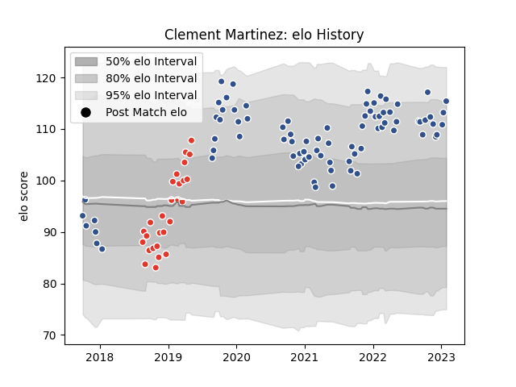

---  
layout: page  
title: Clement Martinez  
date: 2022-12-09 13:12:39.033233  
categories: player  
---
# Clement Martinez

## Positions: H

## Current elo: 105.0

## Current Percentile: 84.0

# Elo History

# Match History

| Team               |   Appearances |   Win Rate |
|:-------------------|--------------:|-----------:|
| Agen               |            62 |   0.217742 |
| Biarritz Olympique |            21 |   0.595238 |

| Opponent             |   Matches |   Win Rate |
|:---------------------|----------:|-----------:|
| Brive                |         5 |   0.3      |
| Bayonne              |         5 |   0.4      |
| Montauban            |         4 |   0.5      |
| Bordeaux Begles      |         4 |   0        |
| Carcassonne          |         4 |   0.5      |
| Stade Toulousain     |         4 |   0        |
| Clermont Auvergne    |         4 |   0        |
| Pau                  |         4 |   0        |
| Mont-de-Marsan       |         3 |   0.666667 |
| US Bressane          |         3 |   0.333333 |
| Racing 92            |         3 |   0.166667 |
| Provence Rugby       |         3 |   0.666667 |
| Oyonnax              |         3 |   0.333333 |
| Aurillac             |         3 |   1        |
| Massy                |         3 |   0.666667 |
| Grenoble             |         3 |   0.333333 |
| Colomiers            |         3 |   0.333333 |
| Castres Olympique    |         3 |   0        |
| Beziers              |         2 |   0.5      |
| Montpellier Herault  |         2 |   0        |
| Narbonne             |         2 |   0.5      |
| Gloucester Rugby     |         2 |   0        |
| La Rochelle          |         2 |   0        |
| Stade Francais Paris |         2 |   0.5      |
| Wasps                |         1 |   0        |
| Vannes               |         1 |   0        |
| Rouen                |         1 |   1        |
| Toulon               |         1 |   0        |
| Soyaux-Angouleme     |         1 |   0        |
| Edinburgh            |         1 |   0        |
| Zebre                |         1 |   1        |