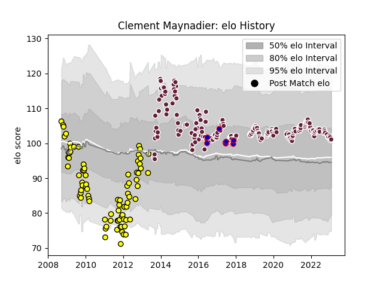

---  
layout: page  
title: Clement Maynadier  
date: 2022-12-31 16:27:05.560045  
categories: player  
---
# Clement Maynadier

## Positions: H

## Country: France

## Current elo: 111.0

## Current Percentile: 92.0

# Elo History

# Match History

| Team            |   Appearances |   Win Rate |
|:----------------|--------------:|-----------:|
| Bordeaux Begles |           197 |   0.550761 |
| Albi            |            81 |   0.506173 |
| France          |             8 |   0.125    |

| Opponent             |   Matches |   Win Rate |
|:---------------------|----------:|-----------:|
| Castres Olympique    |        19 |   0.552632 |
| Stade Toulousain     |        16 |   0.28125  |
| Montpellier Herault  |        16 |   0.40625  |
| Stade Francais Paris |        16 |   0.625    |
| Toulon               |        15 |   0.333333 |
| La Rochelle          |        14 |   0.642857 |
| Racing 92            |        14 |   0.357143 |
| Brive                |        14 |   0.5      |
| Lyon                 |        14 |   0.785714 |
| Clermont Auvergne    |        14 |   0.535714 |
| Perpignan            |        10 |   0.65     |
| Pau                  |        10 |   0.3      |
| Grenoble             |        10 |   0.7      |
| Oyonnax              |         9 |   0.666667 |
| Bayonne              |         7 |   0.714286 |
| Agen                 |         6 |   1        |
| Biarritz Olympique   |         6 |   0.666667 |
| Dax                  |         5 |   0.4      |
| Tarbes               |         5 |   0.8      |
| Narbonne             |         4 |   0.25     |
| South Africa         |         4 |   0        |
| Provence Rugby       |         4 |   0.75     |
| Bourgoin-Jallieu     |         4 |   0.25     |
| Auch                 |         4 |   0.75     |
| Aurillac             |         4 |   0.75     |
| Carcassonne          |         4 |   0.25     |
| Beziers              |         4 |   0.5      |
| Edinburgh            |         3 |   0.666667 |
| Bath Rugby           |         2 |   0        |
| Ospreys              |         2 |   0.5      |
| Bordeaux Begles      |         2 |   0.5      |
| Exeter Chiefs        |         2 |   0.5      |
| Périgueux            |         2 |   0.5      |
| Ulster               |         2 |   1        |
| London Welsh         |         2 |   1        |
| Argentina            |         2 |   0.5      |
| Sharks               |         1 |   0        |
| US Bressane          |         1 |   1        |
| Saint-Etienne        |         1 |   1        |
| Leicester Tigers     |         1 |   0        |
| New Zealand          |         1 |   0        |
| Montauban            |         1 |   0        |
| Mont-de-Marsan       |         1 |   0        |
| Massy                |         1 |   1        |
| Gloucester Rugby     |         1 |   0        |
| England              |         1 |   0        |
| Dragons              |         1 |   1        |
| Connacht             |         1 |   0        |
| Colomiers            |         1 |   1        |
| Bristol Rugby        |         1 |   0        |
| Wasps                |         1 |   1        |