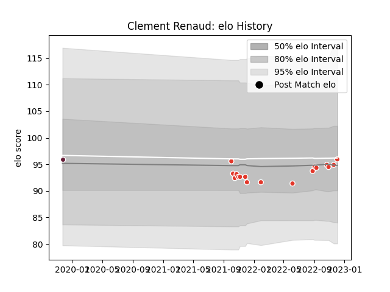

---  
layout: page  
title: Clement Renaud  
date: 2023-01-06 11:44:45.870576  
categories: player  
---
# Clement Renaud

## Positions: H

## Current elo: 94.0

## Current Percentile: 40.0

# Elo History

# Match History

| Team               |   Appearances |   Win Rate |
|:-------------------|--------------:|-----------:|
| Biarritz Olympique |            18 |   0.361111 |
| Bordeaux Begles    |             1 |   0.5      |

| Opponent             |   Matches |   Win Rate |
|:---------------------|----------:|-----------:|
| Brive                |         2 |        0.5 |
| Stade Toulousain     |         2 |        0   |
| Montauban            |         1 |        1   |
| Toulon               |         1 |        0   |
| Stade Francais Paris |         1 |        1   |
| Rouen                |         1 |        0   |
| Pau                  |         1 |        0   |
| Oyonnax              |         1 |        1   |
| Mont-de-Marsan       |         1 |        0   |
| Castres Olympique    |         1 |        0   |
| Massy                |         1 |        1   |
| Lyon                 |         1 |        0   |
| Grenoble             |         1 |        0.5 |
| Edinburgh            |         1 |        0.5 |
| Colomiers            |         1 |        1   |
| Clermont Auvergne    |         1 |        0   |
| Vannes               |         1 |        0   |