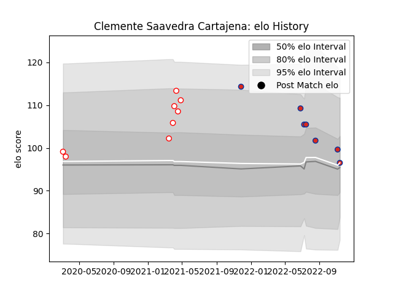

---  
layout: page  
title: Clemente Saavedra Cartajena  
date: 2022-11-15 23:39:21.632355  
categories: player  
---
# Clemente Saavedra Cartajena

## Positions: L, FL

## Country: Chile

## Current elo: 97.0

## Current Percentile: 67.0

# Elo History

# Match History

| Team    |   Appearances |   Win Rate |
|:--------|--------------:|-----------:|
| Selknam |             8 |   0.625    |
| Chile   |             7 |   0.428571 |

| Opponent                 |   Matches |   Win Rate |
|:-------------------------|----------:|-----------:|
| Penarol Rugby            |         3 |   0.666667 |
| Cafeteros Pro            |         2 |   1        |
| United States of America |         2 |   0.5      |
| Brazil                   |         1 |   1        |
| Ceibos Rugby             |         1 |   0        |
| Cobras                   |         1 |   1        |
| Olimpia Lions            |         1 |   0        |
| Romania                  |         1 |   0        |
| Russia                   |         1 |   1        |
| Scotland                 |         1 |   0        |
| Tonga                    |         1 |   0        |