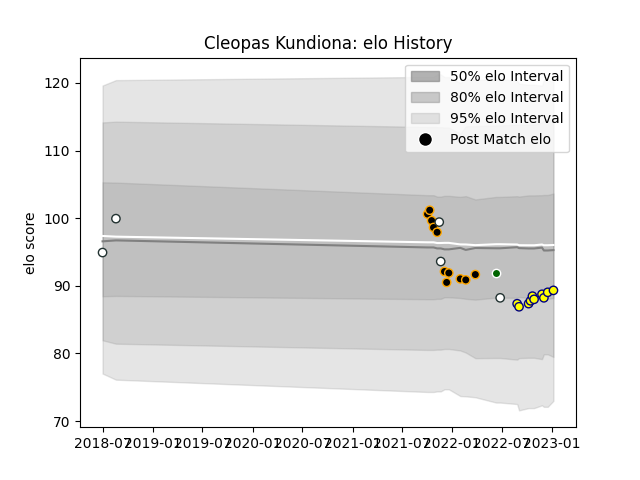

---  
layout: page  
title: Cleopas Kundiona  
date: 2022-12-12 15:04:23.632909  
categories: player  
---
# Cleopas Kundiona

## Positions: P

## Country: Zimbabwe

## Current elo: 88.0

## Current Percentile: 20.0

# Elo History

# Match History

| Team              |   Appearances |   Win Rate |
|:------------------|--------------:|-----------:|
| Chambery          |            10 |   0.3      |
| Nevers            |             8 |   0.5      |
| Zimbabwe          |             3 |   0.666667 |
| Zimbabwe Goshawks |             1 |   0        |

| Opponent                   |   Matches |   Win Rate |
|:---------------------------|----------:|-----------:|
| Blagnac                    |         2 |        0.5 |
| Soyaux-Angouleme           |         2 |        1   |
| Albi                       |         1 |        0   |
| Namibia                    |         1 |        0   |
| Valence Romans Drome Rugby |         1 |        0   |
| Tarbes                     |         1 |        0   |
| Rouen                      |         1 |        1   |
| Provence Rugby             |         1 |        1   |
| Nice                       |         1 |        0   |
| Netherlands                |         1 |        1   |
| Montauban                  |         1 |        0   |
| Beziers                    |         1 |        1   |
| Mont-de-Marsan             |         1 |        0   |
| Massy                      |         1 |        0   |
| Grenoble                   |         1 |        0   |
| Colomiers                  |         1 |        0   |
| Cognac Saint Jean d'Angély |         1 |        1   |
| Brazil                     |         1 |        1   |
| Bourgoin-Jallieu           |         1 |        0   |
| Valke                      |         1 |        0   |