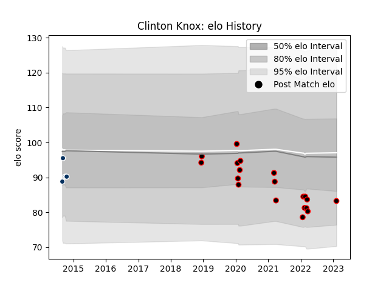

---  
layout: page  
title: Clinton Knox  
date: 2023-03-21 18:33:13.717109  
categories: player  
---
# Clinton Knox

Last updated: 2023-03-21
## Positions: C

## Current elo: 88.0

## Current Percentile: 13.0

# Elo History

# Match History

| Team               |   Appearances |   Win Rate |
|:-------------------|--------------:|-----------:|
| Mie Honda Heat     |            22 |   0.545455 |
| Queensland Country |             5 |   0.2      |

| Opponent                          |   Matches |   Win Rate |
|:----------------------------------|----------:|-----------:|
| Yokohama Canon Eagles             |         2 |          1 |
| Toyota Verblitz                   |         2 |          0 |
| Hanazono Kintetsu Liners          |         2 |          0 |
| Hino Red Dolphins                 |         2 |          1 |
| Toyota Industries Shuttles Aichi  |         2 |          1 |
| Kubota Spears Funabashi Tokyo-Bay |         2 |          0 |
| Skyactivs Hiroshima               |         2 |          1 |
| Shimizu Blue Sharks               |         1 |          1 |
| Urayasu D-Rocks                   |         1 |          0 |
| Toshiba Brave Lupus Tokyo         |         1 |          0 |
| Sydney Stars                      |         1 |          1 |
| Black Rams Tokyo                  |         1 |          1 |
| NSW Country Eagles                |         1 |          0 |
| Brisbane City                     |         1 |          0 |
| Mitsubishi Dynaboars              |         1 |          0 |
| Melbourne Rising                  |         1 |          0 |
| Kamaishi Seawaves                 |         1 |          1 |
| Green Rockets Tokatsu             |         1 |          1 |
| Canberra Vikings                  |         1 |          0 |
| Munakata Sanix Blues              |         1 |          0 |