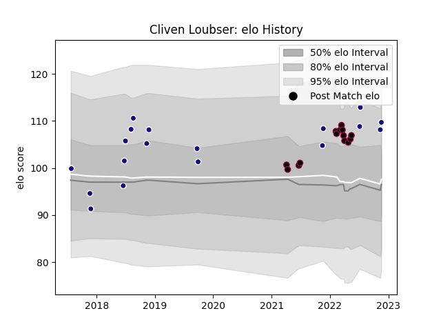

---  
layout: page  
title: Cliven Loubser  
date: 2023-03-02 11:23:56.378184  
categories: player  
---
# Cliven Loubser

## Positions: FH, FB

## Country: Namibia

## Current elo: 122.0

## Current Percentile: 89.0

# Elo History

# Match History

| Team          |   Appearances |   Win Rate |
|:--------------|--------------:|-----------:|
| Namibia       |            19 |   0.684211 |
| Utah Warriors |            18 |   0.444444 |

| Opponent               |   Matches |   Win Rate |
|:-----------------------|----------:|-----------:|
| Zimbabwe               |         4 |   1        |
| San Diego Legion       |         3 |   0.333333 |
| Houston SaberCats      |         3 |   0.333333 |
| Kenya                  |         3 |   1        |
| Seattle Seawolves      |         3 |   0        |
| Uruguay                |         2 |   0        |
| Uganda                 |         2 |   1        |
| Toronto Arrows         |         2 |   0.5      |
| Rugby ATL              |         2 |   0.5      |
| Tunisia                |         1 |   1        |
| Spain                  |         1 |   0        |
| South Africa           |         1 |   0        |
| Canada                 |         1 |   1        |
| Russia                 |         1 |   0        |
| Dallas Jackals         |         1 |   1        |
| R.U. New York          |         1 |   1        |
| Portugal               |         1 |   1        |
| New England Free Jacks |         1 |   0        |
| Morocco                |         1 |   1        |
| L. A. Giltinis         |         1 |   1        |
| Italy                  |         1 |   0        |
| Rugby New York         |         1 |   1        |