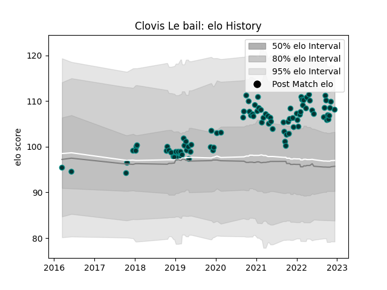

---  
layout: page  
title: Clovis Le bail  
date: 2022-12-18 16:23:56.636243  
categories: player  
---
# Clovis Le bail

## Positions: SH

## Current elo: 111.0

## Current Percentile: 84.0

# Elo History

# Match History

| Team   |   Appearances |   Win Rate |
|:-------|--------------:|-----------:|
| Pau    |            94 |   0.398936 |

| Opponent             |   Matches |   Win Rate |
|:---------------------|----------:|-----------:|
| La Rochelle          |         8 |  0.125     |
| Stade Toulousain     |         7 |  0.428571  |
| Stade Francais Paris |         7 |  0.285714  |
| Clermont Auvergne    |         7 |  0.142857  |
| Toulon               |         6 |  0.0833333 |
| Brive                |         6 |  0.166667  |
| Castres Olympique    |         6 |  0         |
| Bordeaux Begles      |         5 |  0.6       |
| Racing 92            |         5 |  0.2       |
| Montpellier Herault  |         5 |  0.4       |
| Lyon                 |         4 |  0.25      |
| Perpignan            |         4 |  1         |
| Agen                 |         4 |  1         |
| Bayonne              |         2 |  1         |
| Gloucester Rugby     |         2 |  1         |
| Ospreys              |         2 |  0.5       |
| Cardiff Blues        |         2 |  0.5       |
| Calvisano            |         2 |  1         |
| Biarritz Olympique   |         2 |  1         |
| Zebre                |         2 |  1         |
| Leicester Tigers     |         1 |  0         |
| London Irish         |         1 |  0         |
| Grenoble             |         1 |  1         |
| Dragons              |         1 |  1         |
| Cheetahs             |         1 |  0         |
| Worcester Warriors   |         1 |  0         |