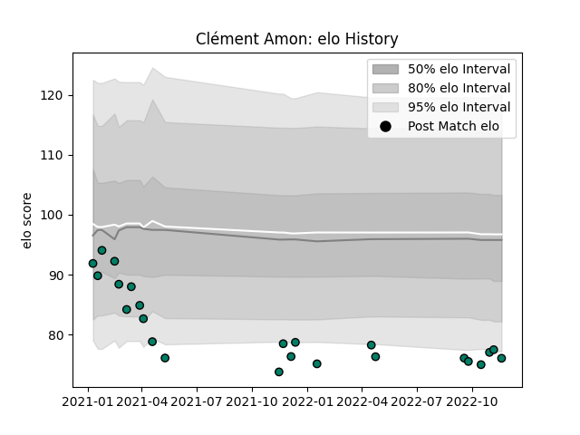

---  
layout: page  
title: Clément Amon  
date: 2022-12-14 11:21:20.585187  
categories: player  
---
# Clément Amon

## Positions: C, FH

## Current elo: 74.0

## Current Percentile: 4.0

# Elo History

# Match History

| Team     |   Appearances |   Win Rate |
|:---------|--------------:|-----------:|
| Suresnes |            26 |   0.269231 |

| Opponent                   |   Matches |   Win Rate |
|:---------------------------|----------:|-----------:|
| Dijon                      |         3 |   0.666667 |
| Massy                      |         3 |   0        |
| Tarbes                     |         3 |   0.666667 |
| US Bressane                |         3 |   0        |
| Blagnac                    |         2 |   0        |
| Chambery                   |         2 |   0.5      |
| Dax                        |         2 |   0        |
| Nice                       |         2 |   0        |
| Albi                       |         1 |   0        |
| Aubenas                    |         1 |   1        |
| Bourgoin-Jallieu           |         1 |   1        |
| Cognac Saint Jean d'Angély |         1 |   0        |
| Narbonne                   |         1 |   0        |
| Valence Romans Drome Rugby |         1 |   0        |