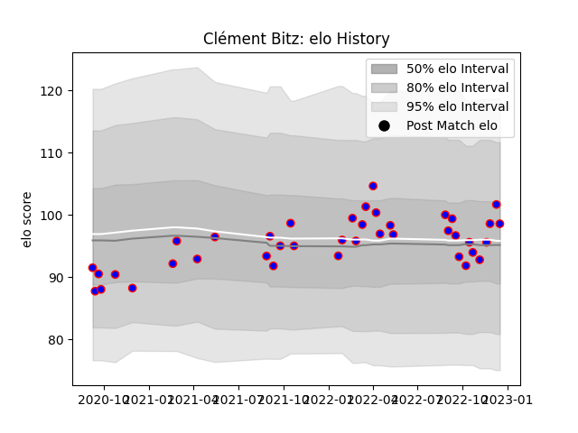

---  
layout: page  
title: Clément Bitz  
date: 2022-12-18 16:21:03.179220  
categories: player  
---
# Clément Bitz

## Positions: L, FL

## Current elo: 99.0

## Current Percentile: 74.0

# Elo History

# Match History

| Team    |   Appearances |   Win Rate |
|:--------|--------------:|-----------:|
| Beziers |            40 |        0.5 |

| Opponent                   |   Matches |   Win Rate |
|:---------------------------|----------:|-----------:|
| Grenoble                   |         4 |   0.75     |
| Agen                       |         3 |   1        |
| Rouen                      |         3 |   0.333333 |
| Provence Rugby             |         3 |   0.333333 |
| Colomiers                  |         3 |   0.333333 |
| Oyonnax                    |         3 |   0.166667 |
| Mont-de-Marsan             |         3 |   0.333333 |
| Nevers                     |         2 |   0.5      |
| Soyaux-Angouleme           |         2 |   0        |
| Montauban                  |         2 |   1        |
| Aurillac                   |         2 |   0.5      |
| Carcassonne                |         2 |   0        |
| Biarritz Olympique         |         2 |   0.5      |
| Vannes                     |         2 |   0.5      |
| Narbonne                   |         1 |   1        |
| Massy                      |         1 |   1        |
| Bayonne                    |         1 |   1        |
| Valence Romans Drome Rugby |         1 |   0.5      |