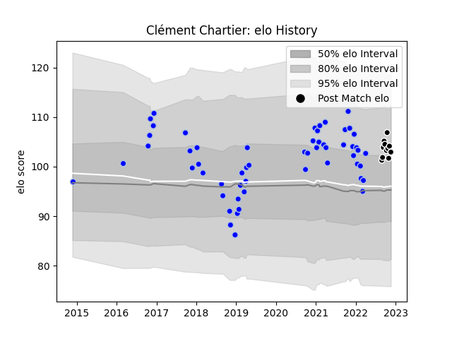

---  
layout: page  
title: Clément Chartier  
date: 2023-03-21 18:39:19.252516  
categories: player  
---
# Clément Chartier

Last updated: 2023-03-21
## Positions: L

## Current elo: 104.0

## Current Percentile: 75.0

# Elo History

# Match History

| Team           |   Appearances |   Win Rate |
|:---------------|--------------:|-----------:|
| Colomiers      |           118 |   0.555085 |
| Provence Rugby |            23 |   0.521739 |

| Opponent                   |   Matches |   Win Rate |
|:---------------------------|----------:|-----------:|
| Aurillac                   |        11 |   0.454545 |
| Carcassonne                |        11 |   0.545455 |
| Montauban                  |        10 |   0.6      |
| Mont-de-Marsan             |         9 |   0.555556 |
| Beziers                    |         9 |   0.333333 |
| Biarritz Olympique         |         9 |   0.333333 |
| Soyaux-Angouleme           |         7 |   0.571429 |
| Oyonnax                    |         7 |   0.642857 |
| Vannes                     |         7 |   0.285714 |
| Grenoble                   |         6 |   0.583333 |
| Narbonne                   |         6 |   0.916667 |
| Agen                       |         5 |   0.4      |
| Provence Rugby             |         5 |   0.8      |
| Perpignan                  |         5 |   0.7      |
| Bourgoin-Jallieu           |         4 |   0.5      |
| Rouen                      |         4 |   0.875    |
| Dax                        |         4 |   0.75     |
| Nevers                     |         4 |   0.5      |
| Massy                      |         4 |   0.5      |
| Bayonne                    |         3 |   0.333333 |
| US Bressane                |         3 |   0.666667 |
| Brive                      |         2 |   0.5      |
| Tarbes                     |         2 |   1        |
| Colomiers                  |         1 |   0        |
| Lyon                       |         1 |   0        |
| Valence Romans Drome Rugby |         1 |   1        |
| Pau                        |         1 |   1        |