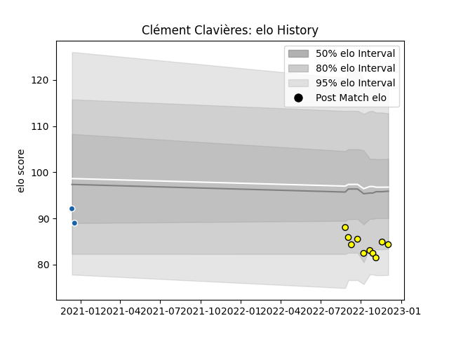

---  
layout: page  
title: Clément Clavières  
date: 2022-12-12 15:39:10.897228  
categories: player  
---
# Clément Clavières

## Positions: FB, W

## Current elo: 84.0

## Current Percentile: 12.0

# Elo History

# Match History

| Team              |   Appearances |   Win Rate |
|:------------------|--------------:|-----------:|
| Carcassonne       |            10 |        0.4 |
| Castres Olympique |             2 |        0   |

| Opponent           |   Matches |   Win Rate |
|:-------------------|----------:|-----------:|
| Aurillac           |         1 |          1 |
| Beziers            |         1 |          1 |
| Biarritz Olympique |         1 |          0 |
| Colomiers          |         1 |          0 |
| Grenoble           |         1 |          0 |
| Massy              |         1 |          0 |
| Montauban          |         1 |          1 |
| Newcastle Falcons  |         1 |          0 |
| Ospreys            |         1 |          0 |
| Oyonnax            |         1 |          0 |
| Provence Rugby     |         1 |          0 |
| Rouen              |         1 |          1 |