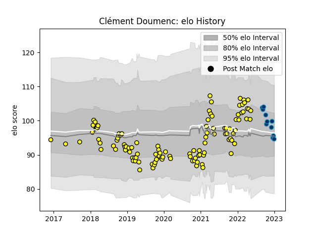

---  
layout: page  
title: Clément Doumenc  
date: 2023-01-06 00:16:34.411891  
categories: player  
---
# Clément Doumenc

## Positions: FL, N8

## Current elo: 101.0

## Current Percentile: 41.0

# Elo History

# Match History

| Team                |   Appearances |   Win Rate |
|:--------------------|--------------:|-----------:|
| Carcassonne         |           110 |   0.540909 |
| Montpellier Herault |            11 |   0.363636 |

| Opponent                   |   Matches |   Win Rate |
|:---------------------------|----------:|-----------:|
| Montauban                  |         9 |   0.666667 |
| Mont-de-Marsan             |         8 |   0.25     |
| Colomiers                  |         8 |   0.625    |
| Oyonnax                    |         8 |   0.125    |
| Vannes                     |         7 |   0.571429 |
| Beziers                    |         7 |   0.571429 |
| Provence Rugby             |         7 |   0.428571 |
| Nevers                     |         7 |   0.571429 |
| Aurillac                   |         7 |   0.714286 |
| Soyaux-Angouleme           |         6 |   0.583333 |
| Grenoble                   |         5 |   0.4      |
| Biarritz Olympique         |         4 |   0.75     |
| Rouen                      |         4 |   0.75     |
| Perpignan                  |         4 |   0.5      |
| US Bressane                |         3 |   1        |
| Narbonne                   |         3 |   1        |
| Agen                       |         3 |   0.333333 |
| Brive                      |         3 |   0.666667 |
| Bayonne                    |         3 |   0.666667 |
| Bordeaux Begles            |         2 |   0.5      |
| Valence Romans Drome Rugby |         2 |   0        |
| Massy                      |         2 |   0.5      |
| Lyon                       |         1 |   0        |
| London Irish               |         1 |   1        |
| La Rochelle                |         1 |   0        |
| Ospreys                    |         1 |   0        |
| Dax                        |         1 |   1        |
| Clermont Auvergne          |         1 |   0        |
| Castres Olympique          |         1 |   0        |
| Racing 92                  |         1 |   0        |
| Roval Drome XV             |         1 |   1        |