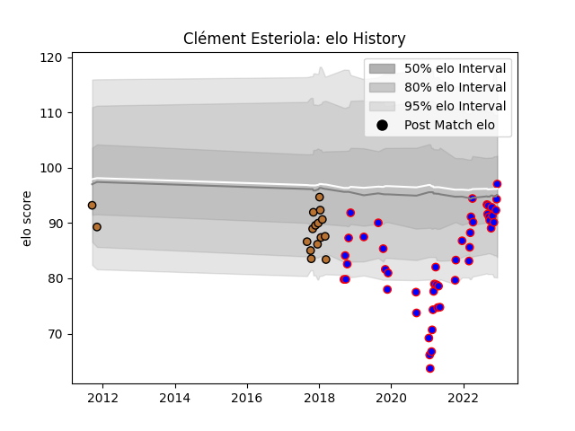

---  
layout: page  
title: Clément Esteriola  
date: 2022-12-14 11:34:00.265356  
categories: player  
---
# Clément Esteriola

## Positions: H

## Current elo: 97.0

## Current Percentile: 47.0

# Elo History

# Match History

| Team     |   Appearances |   Win Rate |
|:---------|--------------:|-----------:|
| Beziers  |            48 |   0.385417 |
| Narbonne |            16 |   0.25     |

| Opponent                   |   Matches |   Win Rate |
|:---------------------------|----------:|-----------:|
| Soyaux-Angouleme           |         6 |   0.166667 |
| Colomiers                  |         6 |   0        |
| Mont-de-Marsan             |         5 |   0.4      |
| Grenoble                   |         5 |   0.4      |
| Montauban                  |         4 |   1        |
| Massy                      |         3 |   0.666667 |
| Aurillac                   |         3 |   0.333333 |
| Rouen                      |         3 |   0.666667 |
| Perpignan                  |         3 |   0        |
| Oyonnax                    |         3 |   0.166667 |
| Vannes                     |         3 |   0.333333 |
| Carcassonne                |         3 |   0        |
| Dax                        |         2 |   0        |
| Nevers                     |         2 |   0        |
| Biarritz Olympique         |         2 |   0.5      |
| Provence Rugby             |         2 |   0.5      |
| Beziers                    |         2 |   0.5      |
| Bayonne                    |         2 |   0.5      |
| La Rochelle                |         1 |   0        |
| Narbonne                   |         1 |   1        |
| Brive                      |         1 |   0        |
| Valence Romans Drome Rugby |         1 |   1        |
| Agen                       |         1 |   1        |