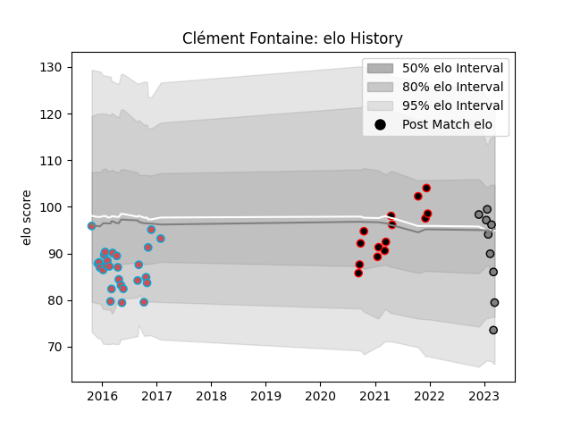

---  
layout: page  
title: Clément Fontaine  
date: 2023-01-17 11:37:44.018494  
categories: player  
---
# Clément Fontaine

## Positions: L

## Current elo: 101.0

## Current Percentile: None

# Elo History

# Match History

| Team             |   Appearances |   Win Rate |
|:-----------------|--------------:|-----------:|
| Bourgoin-Jallieu |            27 |   0.333333 |
| Nice             |            14 |   0.642857 |
| Rennes           |             2 |   0        |

| Opponent           |   Matches |   Win Rate |
|:-------------------|----------:|-----------:|
| Tarbes             |         5 |   0.9      |
| Albi               |         4 |   0.375    |
| Narbonne           |         4 |   0.25     |
| Montauban          |         3 |   0.333333 |
| Beziers            |         3 |   0        |
| Colomiers          |         2 |   0.5      |
| Suresnes           |         2 |   0.5      |
| Provence Rugby     |         2 |   0.5      |
| Biarritz Olympique |         2 |   0.5      |
| Perpignan          |         2 |   0        |
| Carcassonne        |         2 |   0.5      |
| Chambery           |         2 |   1        |
| Dax                |         2 |   0        |
| Agen               |         1 |   0        |
| Mont-de-Marsan     |         1 |   0        |
| Lyon               |         1 |   0        |
| Bourgoin-Jallieu   |         1 |   1        |
| Bayonne            |         1 |   0        |
| Aurillac           |         1 |   0        |
| Aubenas            |         1 |   1        |
| US Bressane        |         1 |   1        |