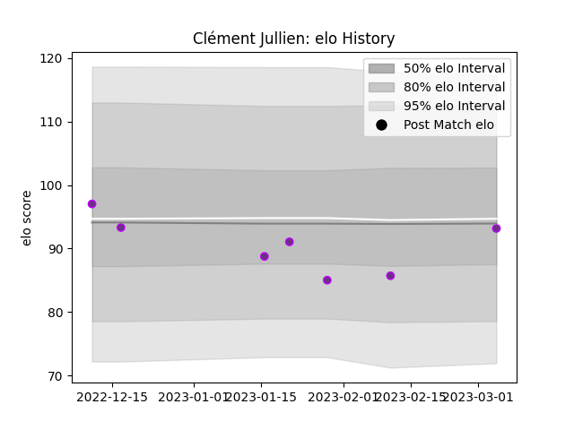

---  
layout: page  
title: Clément Jullien  
date: 2023-03-06 11:23:34.878318  
categories: player  
---
# Clément Jullien

## Positions: H

## Current elo: 93.0

## Current Percentile: 18.0

# Elo History

# Match History

| Team        |   Appearances |   Win Rate |
|:------------|--------------:|-----------:|
| US Bressane |             7 |   0.571429 |

| Opponent                   |   Matches |   Win Rate |
|:---------------------------|----------:|-----------:|
| Blagnac                    |         1 |          0 |
| Chambery                   |         1 |          0 |
| Cognac Saint Jean d'Angély |         1 |          1 |
| Dax                        |         1 |          0 |
| Narbonne                   |         1 |          1 |
| Rennes                     |         1 |          1 |
| Tarbes                     |         1 |          1 |