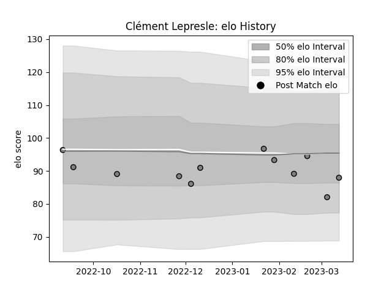

---  
layout: page  
title: Clément Lepresle  
date: 2023-02-02 18:56:29.384709  
categories: player  
---
# Clément Lepresle

## Positions: C

## Current elo: 90.0

## Current Percentile: 48.0

# Elo History

# Match History

| Team   |   Appearances |   Win Rate |
|:-------|--------------:|-----------:|
| Rennes |             8 |          0 |

| Opponent                   |   Matches |   Win Rate |
|:---------------------------|----------:|-----------:|
| Valence Romans Drome Rugby |         2 |          0 |
| Albi                       |         1 |          0 |
| Bourgoin-Jallieu           |         1 |          0 |
| Chambery                   |         1 |          0 |
| Narbonne                   |         1 |          0 |
| Nice                       |         1 |          0 |
| Tarbes                     |         1 |          0 |