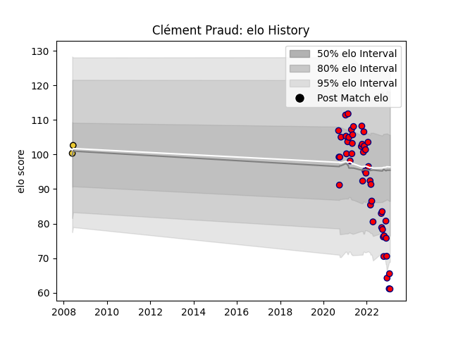

---  
layout: page  
title: Clément Praud  
date: 2022-11-22 11:38:43.473084  
categories: player  
---
# Clément Praud

## Positions: L

## Current elo: 88.0

## Current Percentile: 23.0

# Elo History

# Match History

| Team                       |   Appearances |   Win Rate |
|:---------------------------|--------------:|-----------:|
| Cognac Saint Jean d'Angély |            42 |   0.297619 |
| La Rochelle                |             1 |   1        |

| Opponent                   |   Matches |   Win Rate |
|:---------------------------|----------:|-----------:|
| Tarbes                     |         6 |   0.25     |
| Albi                       |         4 |   0.25     |
| Dijon                      |         4 |   1        |
| Aubenas                    |         3 |   0.333333 |
| Blagnac                    |         3 |   0.333333 |
| Bourgoin-Jallieu           |         3 |   0.333333 |
| Dax                        |         3 |   0.666667 |
| Massy                      |         3 |   0        |
| Nice                       |         3 |   0        |
| Chambery                   |         2 |   0        |
| Narbonne                   |         2 |   0        |
| Suresnes                   |         2 |   1        |
| US Bressane                |         2 |   0        |
| Rennes                     |         1 |   0        |
| Soyaux-Angouleme           |         1 |   0        |
| Valence Romans Drome Rugby |         1 |   0        |