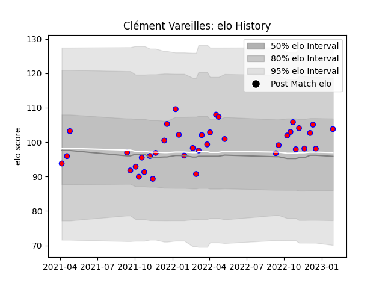

---  
layout: page  
title: Clément Vareilles  
date: 2023-01-30 11:41:57.711503  
categories: player  
---
# Clément Vareilles

## Positions: C

## Current elo: 104.0

## Current Percentile: 55.0

# Elo History

# Match History

| Team    |   Appearances |   Win Rate |
|:--------|--------------:|-----------:|
| Blagnac |            38 |   0.513158 |

| Opponent                   |   Matches |   Win Rate |
|:---------------------------|----------:|-----------:|
| Tarbes                     |         4 |   0.75     |
| Chambery                   |         4 |   0.75     |
| Albi                       |         3 |   0        |
| Dax                        |         3 |   0.333333 |
| Suresnes                   |         3 |   0.666667 |
| Valence Romans Drome Rugby |         3 |   0.333333 |
| Cognac Saint Jean d'Angély |         2 |   0.5      |
| Dijon                      |         2 |   0.5      |
| Aubenas                    |         2 |   1        |
| Nice                       |         2 |   0.5      |
| Soyaux-Angouleme           |         2 |   0        |
| Bourgoin-Jallieu           |         2 |   0.5      |
| Massy                      |         2 |   0        |
| Narbonne                   |         1 |   0.5      |
| Rennes                     |         1 |   1        |
| Carqueiranne-Hyères        |         1 |   1        |
| US Bressane                |         1 |   1        |