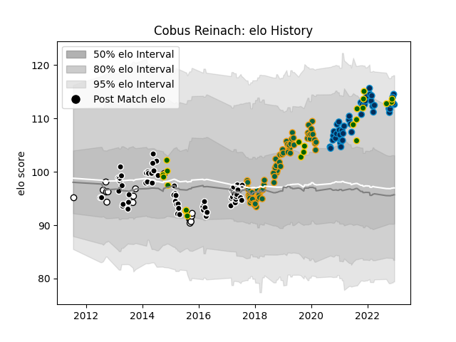

---  
layout: page  
title: Cobus Reinach  
date: 2022-12-14 11:31:54.605003  
categories: player  
---
# Cobus Reinach

## Positions: SH

## Country: South Africa

## Current elo: 115.0

## Current Percentile: 90.0

# Elo History

# Match History

| Team                |   Appearances |   Win Rate |
|:--------------------|--------------:|-----------:|
| Northampton Saints  |            72 |   0.430556 |
| Sharks              |            60 |   0.55     |
| Montpellier Herault |            43 |   0.523256 |
| South Africa        |            22 |   0.727273 |
| Natal Sharks        |            16 |   0.65625  |

| Opponent                 |   Matches |   Win Rate |
|:-------------------------|----------:|-----------:|
| Clermont Auvergne        |         9 |   0.333333 |
| Bulls                    |         8 |   0.3125   |
| Exeter Chiefs            |         7 |   0.142857 |
| Lions                    |         7 |   0.285714 |
| Sale Sharks              |         6 |   0.333333 |
| Saracens                 |         6 |   0        |
| Cheetahs                 |         6 |   0.5      |
| Stormers                 |         6 |   0.5      |
| Harlequins               |         5 |   0.8      |
| Southern Kings           |         5 |   0.8      |
| Crusaders                |         5 |   0.4      |
| Worcester Warriors       |         5 |   0.8      |
| Leicester Tigers         |         5 |   0.8      |
| Blue Bulls               |         5 |   0.8      |
| Wasps                    |         5 |   0.4      |
| Western Province         |         5 |   0.6      |
| Lyon                     |         5 |   0.6      |
| Gloucester Rugby         |         5 |   0.4      |
| Newcastle Falcons        |         4 |   0.25     |
| Castres Olympique        |         4 |   0.25     |
| London Irish             |         4 |   0.75     |
| Argentina                |         4 |   0.75     |
| Bath Rugby               |         4 |   0.25     |
| Australia                |         4 |   0.75     |
| Racing 92                |         4 |   0.25     |
| La Rochelle              |         3 |   0.666667 |
| Jaguares                 |         3 |   1        |
| Pau                      |         3 |   0.333333 |
| Stade Francais Paris     |         3 |   1        |
| Queensland Reds          |         3 |   0.666667 |
| Brumbies                 |         3 |   0.333333 |
| Brive                    |         3 |   0.5      |
| Toulon                   |         3 |   0.666667 |
| Bristol Rugby            |         3 |   0.333333 |
| Blues                    |         3 |   0.666667 |
| Bayonne                  |         3 |   0.666667 |
| Melbourne Rebels         |         3 |   0.833333 |
| Perpignan                |         2 |   1        |
| New Zealand              |         2 |   0.5      |
| Ospreys                  |         2 |   0        |
| Stade Toulousain         |         2 |   0        |
| Wales                    |         2 |   0.5      |
| Agen                     |         2 |   1        |
| Italy                    |         2 |   1        |
| Chiefs                   |         2 |   0.5      |
| Benetton Treviso         |         2 |   1        |
| Highlanders              |         2 |   0.5      |
| Griquas                  |         2 |   1        |
| Golden Lions             |         2 |   0        |
| Bordeaux Begles          |         2 |   0        |
| England                  |         2 |   0.5      |
| Dragons                  |         2 |   1        |
| Western Force            |         1 |   1        |
| Biarritz Olympique       |         1 |   1        |
| British and Irish Lions  |         1 |   1        |
| Sunwolves                |         1 |   1        |
| Canada                   |         1 |   1        |
| New South Wales Waratahs |         1 |   1        |
| Namibia                  |         1 |   1        |
| France                   |         1 |   0        |
| Free State Cheetahs      |         1 |   0.5      |
| Georgia                  |         1 |   1        |
| Pumas                    |         1 |   1        |
| Hurricanes               |         1 |   1        |
| Leinster                 |         1 |   0        |
| Scotland                 |         1 |   1        |