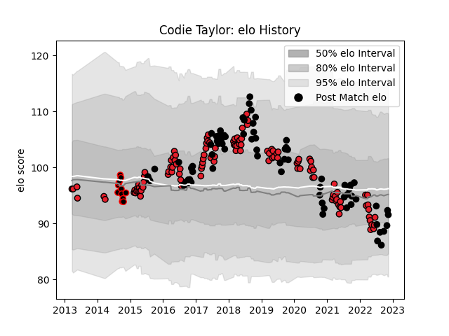

---  
layout: page  
title: Codie Taylor  
date: 2022-11-15 23:38:05.216232  
categories: player  
---
# Codie Taylor

## Positions: H

## Country: New Zealand

## Current elo: 92.0

## Current Percentile: 35.0

# Elo History

# Match History

| Team              |   Appearances |   Win Rate |
|:------------------|--------------:|-----------:|
| Crusaders         |           117 |   0.769231 |
| New Zealand       |            75 |   0.78     |
| Canterbury        |            12 |   0.666667 |
| New Zealand Maori |             1 |   1        |

| Opponent                 |   Matches |   Win Rate |
|:-------------------------|----------:|-----------:|
| Australia                |        19 |   0.763158 |
| Chiefs                   |        19 |   0.578947 |
| Highlanders              |        15 |   0.733333 |
| Hurricanes               |        15 |   0.666667 |
| Blues                    |        13 |   0.923077 |
| South Africa             |        12 |   0.791667 |
| Argentina                |        11 |   0.818182 |
| New South Wales Waratahs |         8 |   0.625    |
| Ireland                  |         8 |   0.375    |
| Lions                    |         7 |   0.857143 |
| Brumbies                 |         6 |   1        |
| Queensland Reds          |         6 |   1        |
| Sharks                   |         5 |   0.7      |
| Melbourne Rebels         |         5 |   0.8      |
| France                   |         5 |   1        |
| Bulls                    |         4 |   0.75     |
| Wales                    |         4 |   1        |
| British and Irish Lions  |         4 |   0.375    |
| Stormers                 |         3 |   0.833333 |
| Western Force            |         3 |   1        |
| Jaguares                 |         3 |   1        |
| Japan                    |         2 |   1        |
| Namibia                  |         2 |   1        |
| Cheetahs                 |         2 |   1        |
| England                  |         2 |   0.5      |
| Northland                |         2 |   1        |
| Fiji                     |         2 |   1        |
| Scotland                 |         2 |   1        |
| Tasman                   |         2 |   0        |
| Italy                    |         1 |   1        |
| Wellington               |         1 |   1        |
| Waikato                  |         1 |   1        |
| Tonga                    |         1 |   1        |
| Taranaki                 |         1 |   1        |
| Counties Manukau         |         1 |   1        |
| Southland                |         1 |   0        |
| Southern Kings           |         1 |   1        |
| Auckland                 |         1 |   1        |
| Samoa                    |         1 |   1        |
| Otago                    |         1 |   1        |
| North Harbour            |         1 |   0        |
| Moana Pasifika           |         1 |   1        |
| Canada                   |         1 |   1        |