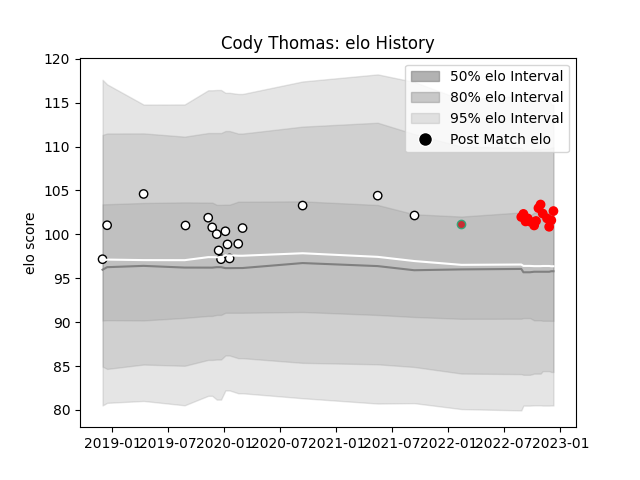

---  
layout: page  
title: Cody Thomas  
date: 2022-11-22 11:35:14.716983  
categories: player  
---
# Cody Thomas

## Positions: P

## Country: Portugal

## Current elo: 101.0

## Current Percentile: 73.0

# Elo History

# Match History

| Team     |   Appearances |   Win Rate |
|:---------|--------------:|-----------:|
| Brive    |            17 |   0.323529 |
| Rouen    |            11 |   0.545455 |
| Portugal |             1 |   0        |

| Opponent             |   Matches |   Win Rate |
|:---------------------|----------:|-----------:|
| Mont-de-Marsan       |         2 |        0.5 |
| Carcassonne          |         2 |        0.5 |
| Montpellier Herault  |         2 |        0   |
| Lyon                 |         2 |        0.5 |
| Zebre                |         2 |        0.5 |
| Bristol Rugby        |         2 |        0   |
| Castres Olympique    |         1 |        0   |
| Vannes               |         1 |        1   |
| US Bressane          |         1 |        1   |
| Toulon               |         1 |        0   |
| Stade Francais Paris |         1 |        1   |
| Soyaux-Angouleme     |         1 |        1   |
| Romania              |         1 |        0   |
| Pau                  |         1 |        0   |
| Oyonnax              |         1 |        0   |
| Nevers               |         1 |        0   |
| Biarritz Olympique   |         1 |        1   |
| Bayonne              |         1 |        0.5 |
| Massy                |         1 |        1   |
| Bordeaux Begles      |         1 |        0   |
| Grenoble             |         1 |        0   |
| Colomiers            |         1 |        1   |
| Agen                 |         1 |        0   |