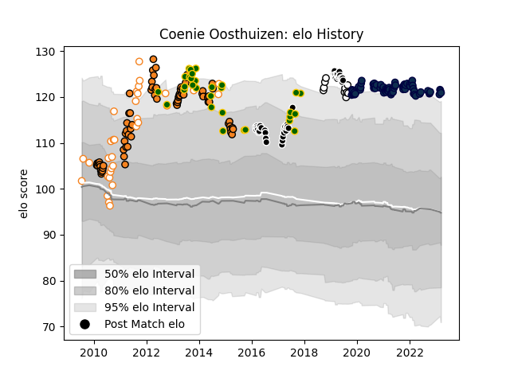

---  
layout: page  
title: Coenie Oosthuizen  
date: 2023-02-17 13:04:30.794386  
categories: player  
---
# Coenie Oosthuizen

## Positions: P

## Country: South Africa

## Current elo: 122.0

## Current Percentile: 95.0

# Elo History

# Match History

| Team                |   Appearances |   Win Rate |
|:--------------------|--------------:|-----------:|
| Cheetahs            |            74 |   0.425676 |
| Sale Sharks         |            68 |   0.625    |
| Sharks              |            44 |   0.511364 |
| Free State Cheetahs |            33 |   0.545455 |
| South Africa        |            30 |   0.75     |
| Natal Sharks        |            10 |   0.6      |

| Opponent                 |   Matches |   Win Rate |
|:-------------------------|----------:|-----------:|
| Lions                    |        13 |   0.384615 |
| Bulls                    |        12 |   0.125    |
| Stormers                 |        11 |   0.363636 |
| Western Province         |        10 |   0.5      |
| Blue Bulls               |         9 |   0.611111 |
| Sharks                   |         9 |   0.444444 |
| Exeter Chiefs            |         9 |   0.333333 |
| Brumbies                 |         8 |   0.375    |
| Northampton Saints       |         7 |   0.857143 |
| Leicester Tigers         |         7 |   0.857143 |
| Gloucester Rugby         |         6 |   0.666667 |
| New South Wales Waratahs |         6 |   0.833333 |
| London Irish             |         6 |   0.833333 |
| Queensland Reds          |         6 |   0.166667 |
| Hurricanes               |         6 |   0.333333 |
| Golden Lions             |         6 |   0.416667 |
| Melbourne Rebels         |         6 |   0.75     |
| Wasps                    |         6 |   0.833333 |
| Western Force            |         6 |   0.833333 |
| Crusaders                |         6 |   0.25     |
| Bristol Rugby            |         6 |   0.666667 |
| Blues                    |         6 |   0.666667 |
| Griquas                  |         5 |   0.6      |
| Harlequins               |         5 |   0.6      |
| Highlanders              |         5 |   0.4      |
| Jaguares                 |         5 |   0.8      |
| Chiefs                   |         5 |   0.1      |
| Bath Rugby               |         5 |   0.3      |
| Worcester Warriors       |         5 |   0.6      |
| Wales                    |         4 |   0.75     |
| Southern Kings           |         4 |   0.75     |
| Pumas                    |         4 |   0.75     |
| Argentina                |         4 |   1        |
| Natal Sharks             |         4 |   0.25     |
| France                   |         4 |   1        |
| Leopards                 |         3 |   1        |
| Australia                |         3 |   0.833333 |
| Scotland                 |         3 |   1        |
| New Zealand              |         3 |   0        |
| Sunwolves                |         2 |   1        |
| Cheetahs                 |         2 |   1        |
| England                  |         2 |   1        |
| Free State Cheetahs      |         2 |   0.5      |
| Italy                    |         2 |   1        |
| Ireland                  |         2 |   0        |
| Saracens                 |         2 |   0        |
| Newcastle Falcons        |         2 |   0.5      |
| Glasgow Warriors         |         1 |   0        |
| United States of America |         1 |   1        |
| Samoa                    |         1 |   1        |
| Japan                    |         1 |   0        |
| La Rochelle              |         1 |   1        |