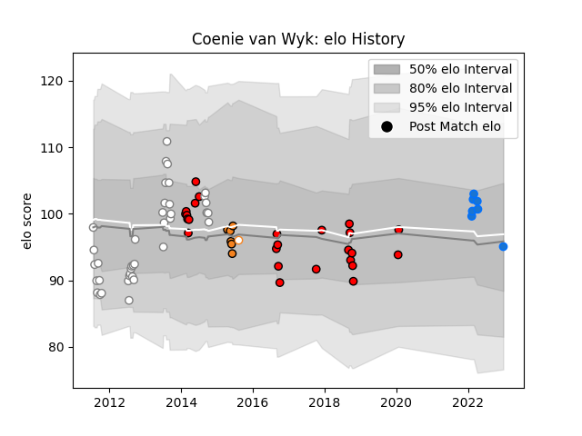

---  
layout: page  
title: Coenie van Wyk  
date: 2023-01-15 11:54:14.290553  
categories: player  
---
# Coenie van Wyk

## Positions: FB, FH

## Current elo: 83.0

## Current Percentile: 31.0

# Elo History

# Match History

| Team                      |   Appearances |   Win Rate |
|:--------------------------|--------------:|-----------:|
| Pumas                     |            38 |   0.631579 |
| Toshiba Brave Lupus Tokyo |            16 |   0.5625   |
| Lions                     |             9 |   0.666667 |
| Shimizu Blue Sharks       |             8 |   0.375    |
| Cheetahs                  |             6 |   0.166667 |
| Free State Cheetahs       |             1 |   0        |

| Opponent                          |   Matches |   Win Rate |
|:----------------------------------|----------:|-----------:|
| Leopards                          |         5 |   0.8      |
| Eastern Province Kings            |         5 |   0.6      |
| SWD Eagles                        |         4 |   0.75     |
| Griffons                          |         3 |   1        |
| Munakata Sanix Blues              |         3 |   0.333333 |
| Boland Cavaliers                  |         3 |   1        |
| Border Bulldogs                   |         3 |   1        |
| Bulls                             |         3 |   0.666667 |
| Valke                             |         3 |   1        |
| Natal Sharks                      |         3 |   0.333333 |
| Blue Bulls                        |         3 |   0        |
| Shizuoka Blue Revs                |         3 |   0.333333 |
| Stormers                          |         2 |   0.5      |
| Queensland Reds                   |         2 |   0.5      |
| Toyota Industries Shuttles Aichi  |         2 |   0        |
| Western Province                  |         2 |   0        |
| Mie Honda Heat                    |         2 |   0.5      |
| Yokohama Canon Eagles             |         2 |   0.5      |
| Golden Lions                      |         2 |   0        |
| Griquas                           |         2 |   0        |
| Coca-Cola Red Sparks              |         2 |   1        |
| Kubota Spears Funabashi Tokyo-Bay |         2 |   0.5      |
| Sharks                            |         1 |   0        |
| Blues                             |         1 |   1        |
| Western Force                     |         1 |   0        |
| Cheetahs                          |         1 |   1        |
| Urayasu D-Rocks                   |         1 |   0        |
| Chugoku Red Regulions             |         1 |   1        |
| Free State Cheetahs               |         1 |   1        |
| Kurita Water Gush                 |         1 |   1        |
| Saitama Wild Knights              |         1 |   0        |
| Green Rockets Tokatsu             |         1 |   1        |
| New South Wales Waratahs          |         1 |   0        |
| NTT Docomo Red Hurricanes Osaka   |         1 |   1        |
| Highlanders                       |         1 |   0        |
| Kamaishi Seawaves                 |         1 |   0        |
| Melbourne Rebels                  |         1 |   1        |
| Lions                             |         1 |   0        |
| Black Rams Tokyo                  |         1 |   1        |