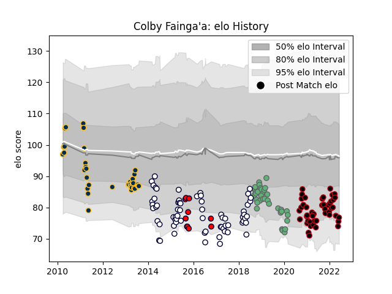

---  
layout: page  
title: Colby Fainga'a  
date: 2023-03-21 18:50:07.777702  
categories: player  
---
# Colby Fainga'a

Last updated: 2023-03-21
## Positions: FL, N8

## Current elo: 77.0

## Current Percentile: 8.0

# Elo History

# Match History

| Team             |   Appearances |   Win Rate |
|:-----------------|--------------:|-----------:|
| Melbourne Rebels |            66 |   0.333333 |
| Lyon             |            46 |   0.48913  |
| Brumbies         |            38 |   0.513158 |
| Connacht         |            35 |   0.542857 |
| Melbourne Rising |            10 |   0.5      |

| Opponent                 |   Matches |   Win Rate |
|:-------------------------|----------:|-----------:|
| New South Wales Waratahs |        11 |   0        |
| Western Force            |        11 |   0.5      |
| Queensland Reds          |        10 |   0.55     |
| Brumbies                 |         9 |   0.555556 |
| Crusaders                |         8 |   0.125    |
| Cheetahs                 |         7 |   0.857143 |
| Hurricanes               |         7 |   0.285714 |
| Chiefs                   |         7 |   0.428571 |
| Montpellier Herault      |         5 |   0.6      |
| Highlanders              |         5 |   0.4      |
| Sharks                   |         5 |   0.4      |
| Southern Kings           |         5 |   0.7      |
| Stade Toulousain         |         5 |   0.4      |
| Blues                    |         5 |   0.6      |
| Bordeaux Begles          |         5 |   0.4      |
| Toulon                   |         4 |   0.5      |
| Racing 92                |         4 |   0.25     |
| Pau                      |         4 |   0.375    |
| Stormers                 |         4 |   0        |
| Bulls                    |         4 |   0.75     |
| Melbourne Rebels         |         4 |   0.75     |
| La Rochelle              |         4 |   0.25     |
| Perpignan                |         3 |   1        |
| Ulster                   |         3 |   0.666667 |
| Leinster                 |         3 |   0        |
| Castres Olympique        |         3 |   0        |
| Cardiff Blues            |         3 |   0.666667 |
| Stade Francais Paris     |         3 |   0.333333 |
| Clermont Auvergne        |         3 |   0.666667 |
| Lions                    |         3 |   0        |
| Sale Sharks              |         2 |   0.5      |
| Scarlets                 |         2 |   0.5      |
| Sunwolves                |         2 |   1        |
| Ospreys                  |         2 |   0.5      |
| Agen                     |         2 |   1        |
| North Harbour Rays       |         2 |   0.5      |
| Jaguares                 |         2 |   0        |
| Dragons                  |         2 |   1        |
| Edinburgh                |         2 |   0        |
| NSW Country Eagles       |         2 |   0.5      |
| Zebre                    |         2 |   1        |
| Bayonne                  |         2 |   1        |
| Greater Sydney Rams      |         1 |   1        |
| Gloucester Rugby         |         1 |   0        |
| Glasgow Warriors         |         1 |   0        |
| Queensland Country       |         1 |   1        |
| Perth Spirit             |         1 |   0        |
| Munster                  |         1 |   0        |
| Canberra Vikings         |         1 |   0        |
| Brive                    |         1 |   0        |
| Sydney Stars             |         1 |   1        |
| Brisbane City            |         1 |   0        |
| Biarritz Olympique       |         1 |   1        |
| Benetton Treviso         |         1 |   1        |
| Worcester Warriors       |         1 |   1        |
| Exeter Chiefs            |         1 |   0        |