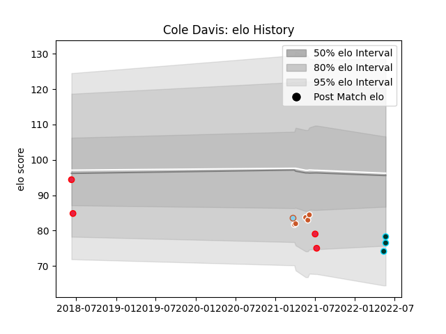

---  
layout: page  
title: Cole Davis  
date: 2023-02-24 02:26:51.667828  
categories: player  
---
# Cole Davis

## Positions: W

## Country: Canada

## Current elo: 78.0

## Current Percentile: 8.0

# Elo History

# Match History

| Team             |   Appearances |   Win Rate |
|:-----------------|--------------:|-----------:|
| Austin Gilgronis |             5 |   0.4      |
| Canada           |             4 |   0        |
| Rugby ATL        |             3 |   0.666667 |
| Austin Herd      |             1 |   0        |

| Opponent               |   Matches |   Win Rate |
|:-----------------------|----------:|-----------:|
| Houston SaberCats      |         2 |          1 |
| Utah Warriors          |         2 |          0 |
| England                |         1 |          0 |
| L. A. Giltinis         |         1 |          0 |
| New England Free Jacks |         1 |          0 |
| R.U. New York          |         1 |          1 |
| Rugby New York         |         1 |          1 |
| Russia                 |         1 |          0 |
| San Diego Legion       |         1 |          0 |
| Scotland               |         1 |          0 |
| Wales                  |         1 |          0 |