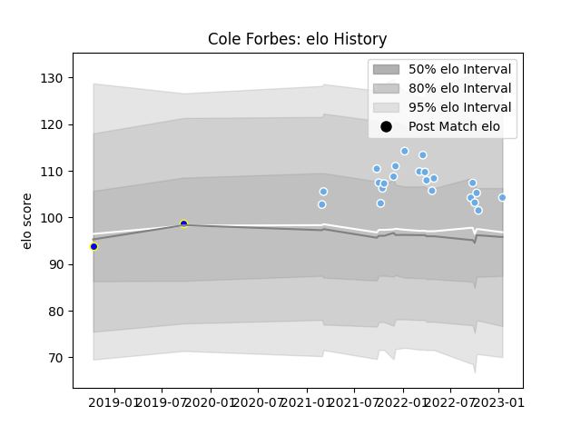

---  
layout: page  
title: Cole Forbes  
date: 2023-01-15 11:45:50.796338  
categories: player  
---
# Cole Forbes

## Positions: W, FB

## Current elo: 104.0

## Current Percentile: 66.0

# Elo History

# Match History

| Team             |   Appearances |   Win Rate |
|:-----------------|--------------:|-----------:|
| Glasgow Warriors |            22 |        0.5 |
| Bay of Plenty    |             2 |        1   |

| Opponent         |   Matches |   Win Rate |
|:-----------------|----------:|-----------:|
| Zebre            |         3 |        1   |
| Benetton Treviso |         2 |        0   |
| Bulls            |         2 |        0.5 |
| Cardiff Blues    |         2 |        0.5 |
| Leinster         |         2 |        0   |
| Northland        |         2 |        1   |
| Ospreys          |         2 |        0.5 |
| Sharks           |         2 |        0.5 |
| Dragons          |         1 |        1   |
| Edinburgh        |         1 |        1   |
| Lions            |         1 |        1   |
| Perpignan        |         1 |        1   |
| Scarlets         |         1 |        0   |
| Stormers         |         1 |        0   |
| Ulster           |         1 |        0   |