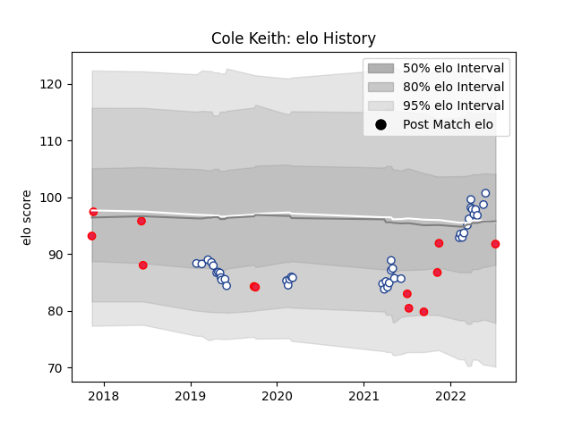

---  
layout: page  
title: Cole Keith  
date: 2023-03-21 18:21:23.911201  
categories: player  
---
# Cole Keith

Last updated: 2023-03-21
## Positions: P

## Country: Canada

## Current elo: 92.0

## Current Percentile: 65.0

# Elo History

# Match History

| Team           |   Appearances |   Win Rate |
|:---------------|--------------:|-----------:|
| Toronto Arrows |            41 |   0.585366 |
| Canada         |            12 |   0.166667 |

| Opponent                 |   Matches |   Win Rate |
|:-------------------------|----------:|-----------:|
| Seattle Seawolves        |         5 |   0.6      |
| NOLA Gold                |         5 |   0.4      |
| Rugby ATL                |         5 |   0.2      |
| R.U. New York            |         4 |   0.75     |
| Utah Warriors            |         4 |   0.75     |
| Old Glory DC             |         3 |   1        |
| Houston SaberCats        |         3 |   0.666667 |
| Spain                    |         2 |   0.5      |
| San Diego Legion         |         2 |   0.5      |
| L. A. Giltinis           |         2 |   0        |
| New England Free Jacks   |         2 |   0.5      |
| Rugby New York           |         2 |   1        |
| United States of America |         1 |   0        |
| Scotland                 |         1 |   0        |
| Russia                   |         1 |   0        |
| Austin Elite Rugby       |         1 |   1        |
| Portugal                 |         1 |   0        |
| Austin Herd              |         1 |   1        |
| New Zealand              |         1 |   0        |
| Italy                    |         1 |   0        |
| Glendale Raptors         |         1 |   1        |
| Georgia                  |         1 |   0        |
| England                  |         1 |   0        |
| Colorado Raptors         |         1 |   0        |
| Belgium                  |         1 |   1        |
| Wales                    |         1 |   0        |