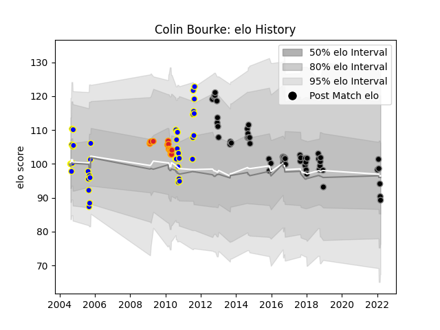

---  
layout: page  
title: Colin Bourke  
date: 2023-03-21 18:34:14.446027  
categories: player  
---
# Colin Bourke

Last updated: 2023-03-21
## Positions: N8, FH

## Current elo: 89.0

## Current Percentile: 33.0

# Elo History

# Match History

| Team             |   Appearances |   Win Rate |
|:-----------------|--------------:|-----------:|
| Black Rams Tokyo |            54 |   0.416667 |
| Bay of Plenty    |            41 |   0.560976 |
| Chiefs           |            15 |   0.3      |

| Opponent                          |   Matches |   Win Rate |
|:----------------------------------|----------:|-----------:|
| Yokohama Canon Eagles             |         6 |   0.666667 |
| Canterbury                        |         5 |   0.2      |
| Kobelco Kobe Steelers             |         4 |   0        |
| Wellington                        |         4 |   0.75     |
| Waikato                           |         4 |   0.75     |
| Toshiba Brave Lupus Tokyo         |         4 |   0.5      |
| Tokyo Sungoliath                  |         4 |   0        |
| Taranaki                          |         4 |   0.25     |
| Southland                         |         4 |   0.75     |
| Shizuoka Blue Revs                |         4 |   0        |
| Saitama Wild Knights              |         4 |   0.25     |
| North Harbour                     |         4 |   0.75     |
| NTT Docomo Red Hurricanes Osaka   |         4 |   1        |
| Auckland                          |         4 |   0.25     |
| Green Rockets Tokatsu             |         4 |   1        |
| Kubota Spears Funabashi Tokyo-Bay |         3 |   0        |
| Northland                         |         3 |   0.666667 |
| Urayasu D-Rocks                   |         3 |   0.333333 |
| Toyota Verblitz                   |         3 |   0        |
| Otago                             |         3 |   0.666667 |
| Hanazono Kintetsu Liners          |         3 |   0.333333 |
| New South Wales Waratahs          |         2 |   0        |
| Coca-Cola Red Sparks              |         2 |   0.75     |
| Western Force                     |         2 |   1        |
| Bulls                             |         2 |   0        |
| Hawke's Bay                       |         2 |   0.5      |
| Munakata Sanix Blues              |         2 |   1        |
| Mie Honda Heat                    |         2 |   0.5      |
| Crusaders                         |         2 |   0        |
| Counties Manukau                  |         2 |   1        |
| Cheetahs                          |         1 |   0.5      |
| Manawatu                          |         1 |   1        |
| Toyota Industries Shuttles Aichi  |         1 |   1        |
| Highlanders                       |         1 |   1        |
| Blues                             |         1 |   0        |
| Stormers                          |         1 |   0        |
| Kyuden Voltex                     |         1 |   0        |
| Sharks                            |         1 |   1        |
| Queensland Reds                   |         1 |   0        |
| Hurricanes                        |         1 |   0        |
| Tasman                            |         1 |   0        |