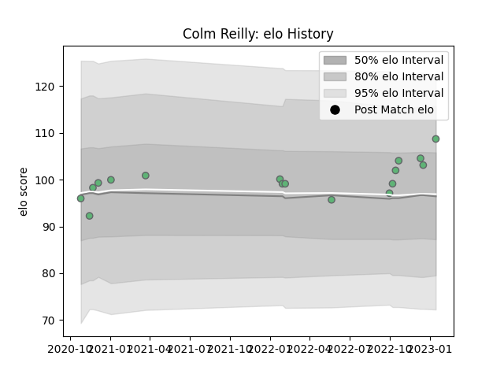

---  
layout: page  
title: Colm Reilly  
date: 2022-12-14 11:35:28.472380  
categories: player  
---
# Colm Reilly

## Positions: SH

## Current elo: 100.0

## Current Percentile: 62.0

# Elo History

# Match History

| Team     |   Appearances |   Win Rate |
|:---------|--------------:|-----------:|
| Connacht |            14 |   0.571429 |

| Opponent          |   Matches |   Win Rate |
|:------------------|----------:|-----------:|
| Scarlets          |         3 |   0.333333 |
| Leinster          |         2 |   0.5      |
| Zebre             |         2 |   1        |
| Benetton Treviso  |         1 |   1        |
| Bulls             |         1 |   0        |
| Edinburgh         |         1 |   1        |
| Glasgow Warriors  |         1 |   0        |
| Munster           |         1 |   1        |
| Newcastle Falcons |         1 |   1        |
| Ulster            |         1 |   0        |