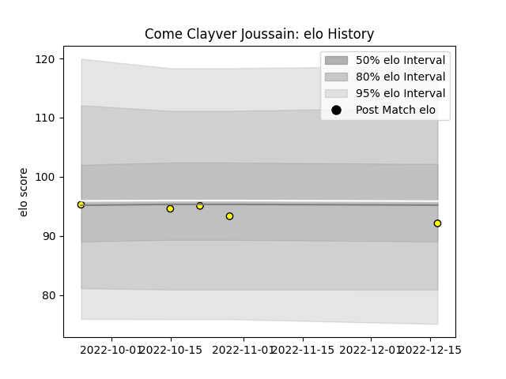

---  
layout: page  
title: Come Clayver Joussain  
date: 2023-01-13 11:27:28.647579  
categories: player  
---
# Come Clayver Joussain

## Positions: L

## Current elo: 89.0

## Current Percentile: 41.0

# Elo History

# Match History

| Team        |   Appearances |   Win Rate |
|:------------|--------------:|-----------:|
| Carcassonne |            10 |        0.2 |

| Opponent           |   Matches |   Win Rate |
|:-------------------|----------:|-----------:|
| Aurillac           |         2 |          1 |
| Mont-de-Marsan     |         2 |          0 |
| Bayonne            |         1 |          0 |
| Biarritz Olympique |         1 |          0 |
| Colomiers          |         1 |          0 |
| Grenoble           |         1 |          0 |
| Oyonnax            |         1 |          0 |
| Soyaux-Angouleme   |         1 |          0 |