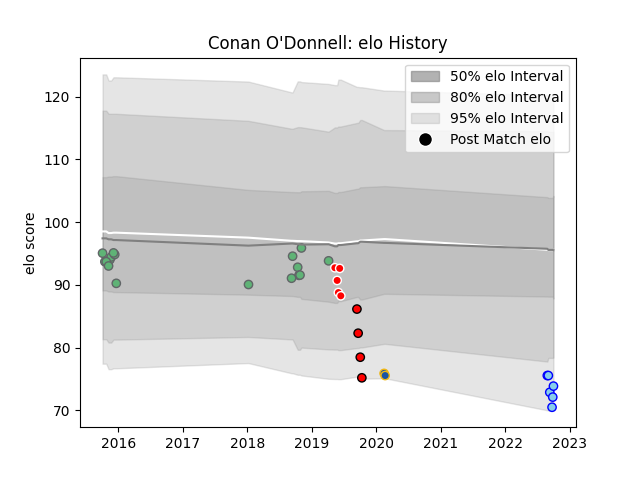

---  
layout: page  
title: Conan O'Donnell  
date: 2023-02-24 02:28:33.664327  
categories: player  
---
# Conan O'Donnell

## Positions: P

## Current elo: 74.0

## Current Percentile: None

# Elo History

# Match History

| Team             |   Appearances |   Win Rate |
|:-----------------|--------------:|-----------:|
| Connacht         |            17 |   0.647059 |
| Northland        |             6 |   0.666667 |
| Sunwolves        |             5 |   0        |
| Counties Manukau |             4 |   0        |
| Highlanders      |             2 |   0.5      |

| Opponent          |   Matches |   Win Rate |
|:------------------|----------:|-----------:|
| Zebre             |         3 |   1        |
| Brumbies          |         3 |   0.333333 |
| Cardiff Blues     |         2 |   0.5      |
| Southland         |         2 |   0.5      |
| Ospreys           |         2 |   0.5      |
| Newcastle Falcons |         2 |   0.5      |
| Manawatu          |         2 |   0.5      |
| Auckland          |         2 |   0.5      |
| Crusaders         |         1 |   0        |
| Dragons           |         1 |   1        |
| Edinburgh         |         1 |   0        |
| Hawke's Bay       |         1 |   0        |
| Bay of Plenty     |         1 |   1        |
| Canterbury        |         1 |   0        |
| Melbourne Rebels  |         1 |   0        |
| Munster           |         1 |   0        |
| Brive             |         1 |   1        |
| Bordeaux Begles   |         1 |   1        |
| RC Enisei         |         1 |   1        |
| Sale Sharks       |         1 |   0        |
| Benetton Treviso  |         1 |   1        |
| Stormers          |         1 |   0        |
| Tasman            |         1 |   0        |
| Jaguares          |         1 |   0        |