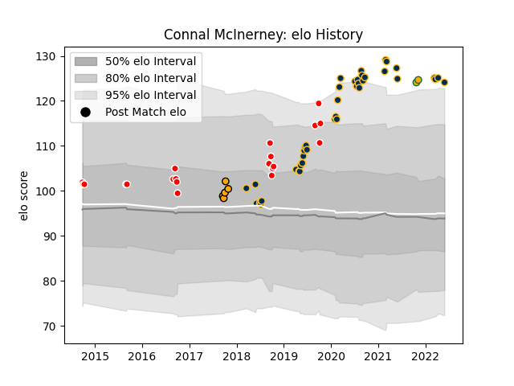

---  
layout: page  
title: Connal McInerney  
date: 2023-02-24 09:49:44.179576  
categories: player  
---
# Connal McInerney

## Positions: H

## Country: Australia

## Current elo: 124.0

## Current Percentile: 96.0

# Elo History

# Match History

| Team               |   Appearances |   Win Rate |
|:-------------------|--------------:|-----------:|
| Brumbies           |            40 |      0.75  |
| Canberra Vikings   |            20 |      0.725 |
| NSW Country Eagles |             5 |      0.5   |
| Australia          |             2 |      0.5   |

| Opponent                 |   Matches |   Win Rate |
|:-------------------------|----------:|-----------:|
| Queensland Reds          |         6 |   0.833333 |
| New South Wales Waratahs |         6 |   1        |
| Melbourne Rebels         |         5 |   0.8      |
| Melbourne Rising         |         4 |   0.5      |
| Sunwolves                |         4 |   1        |
| NSW Country Eagles       |         4 |   0.75     |
| Western Force            |         4 |   1        |
| Fijian Drua              |         4 |   0.5      |
| Chiefs                   |         3 |   0.333333 |
| Sydney Rays              |         3 |   1        |
| Brisbane City            |         3 |   0.833333 |
| North Harbour Rays       |         2 |   0.25     |
| Bulls                    |         2 |   1        |
| Sharks                   |         2 |   1        |
| Queensland Country       |         2 |   0.5      |
| Greater Sydney Rams      |         2 |   1        |
| Jaguares                 |         2 |   0        |
| Blues                    |         2 |   0.5      |
| Highlanders              |         1 |   0        |
| Crusaders                |         1 |   0        |
| Moana Pasifika           |         1 |   0        |
| Canberra Vikings         |         1 |   1        |
| Scotland                 |         1 |   0        |
| Japan                    |         1 |   1        |
| Hurricanes               |         1 |   1        |