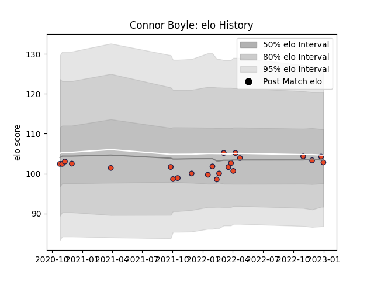

---  
layout: page  
title: Connor Boyle  
date: 2023-01-06 00:19:42.999510  
categories: player  
---
# Connor Boyle

## Positions: FL

## Current elo: 103.0

## Current Percentile: 52.0

# Elo History

# Match History

| Team      |   Appearances |   Win Rate |
|:----------|--------------:|-----------:|
| Edinburgh |            23 |   0.434783 |

| Opponent         |   Matches |   Win Rate |
|:-----------------|----------:|-----------:|
| Glasgow Warriors |         3 |        0   |
| Benetton Treviso |         2 |        0   |
| Cardiff Blues    |         2 |        1   |
| Connacht         |         2 |        0.5 |
| Dragons          |         2 |        0.5 |
| Scarlets         |         2 |        1   |
| Bulls            |         1 |        1   |
| Leinster         |         1 |        0   |
| Lions            |         1 |        0   |
| London Irish     |         1 |        0   |
| Munster          |         1 |        0   |
| Ospreys          |         1 |        0   |
| Pau              |         1 |        1   |
| Sharks           |         1 |        1   |
| Ulster           |         1 |        0   |
| Zebre            |         1 |        1   |