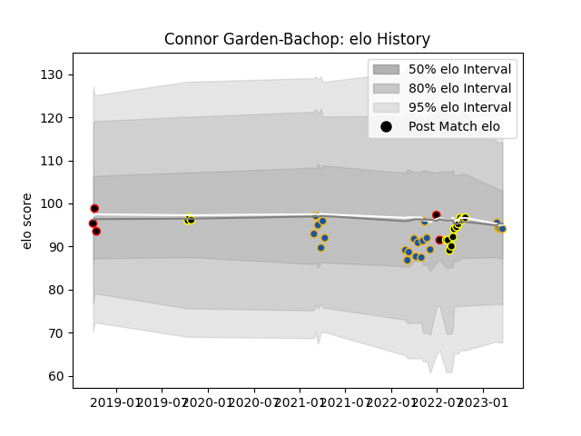

---  
layout: page  
title: Connor Garden-Bachop  
date: 2023-03-21 18:28:39.340981  
categories: player  
---
# Connor Garden-Bachop

Last updated: 2023-03-21
## Positions: FB, W

## Country: New Zealand Maori

## Current elo: 94.0

## Current Percentile: 45.0

# Elo History

# Match History

| Team              |   Appearances |   Win Rate |
|:------------------|--------------:|-----------:|
| Highlanders       |            21 |   0.333333 |
| Wellington        |            15 |   0.8      |
| Canterbury        |             3 |   1        |
| New Zealand Maori |             2 |   0.5      |

| Opponent                 |   Matches |   Win Rate |
|:-------------------------|----------:|-----------:|
| Crusaders                |         5 |   0.2      |
| Blues                    |         4 |   0        |
| Canterbury               |         3 |   0.666667 |
| Chiefs                   |         3 |   0.333333 |
| Hawke's Bay              |         3 |   1        |
| Hurricanes               |         3 |   0        |
| Ireland                  |         2 |   0.5      |
| Taranaki                 |         2 |   1        |
| Waikato                  |         2 |   1        |
| Tasman                   |         2 |   0.5      |
| Western Force            |         2 |   1        |
| Counties Manukau         |         2 |   1        |
| Moana Pasifika           |         1 |   1        |
| New South Wales Waratahs |         1 |   0        |
| Northland                |         1 |   0        |
| Queensland Reds          |         1 |   1        |
| Southland                |         1 |   1        |
| Bay of Plenty            |         1 |   1        |
| Fijian Drua              |         1 |   1        |
| Auckland                 |         1 |   1        |