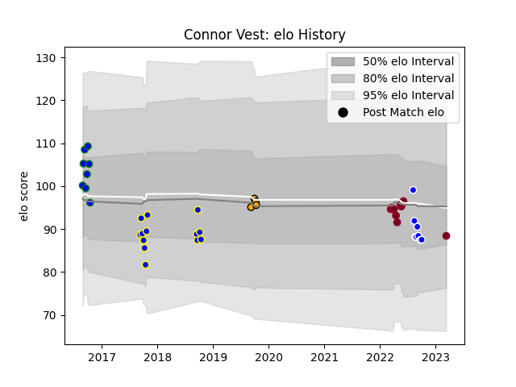

---  
layout: page  
title: Connor Vest  
date: 2023-03-12 11:30:54.005713  
categories: player  
---
# Connor Vest

## Positions: L, FL

## Current elo: 88.0

## Current Percentile: 36.0

# Elo History

# Match History

| Team               |   Appearances |   Win Rate |
|:-------------------|--------------:|-----------:|
| Sydney Rays        |            13 |   0.230769 |
| Queensland Reds    |            10 |   0.5      |
| Auckland           |             8 |   0.5      |
| North Harbour Rays |             8 |   0.75     |
| NSW Country Eagles |             4 |   0.5      |

| Opponent                 |   Matches |   Win Rate |
|:-------------------------|----------:|-----------:|
| Melbourne Rising         |         4 |   0.75     |
| Queensland Country       |         4 |   0.25     |
| Brisbane City            |         3 |   0.333333 |
| Canberra Vikings         |         3 |   0.333333 |
| Fijian Drua              |         3 |   0.666667 |
| NSW Country Eagles       |         3 |   0        |
| Perth Spirit             |         3 |   0.666667 |
| Brumbies                 |         2 |   0.5      |
| Crusaders                |         2 |   0        |
| Greater Sydney Rams      |         2 |   0.5      |
| Bay of Plenty            |         1 |   0        |
| Northland                |         1 |   0        |
| Waikato                  |         1 |   0        |
| Taranaki                 |         1 |   1        |
| Southland                |         1 |   1        |
| Otago                    |         1 |   1        |
| Moana Pasifika           |         1 |   1        |
| North Harbour            |         1 |   1        |
| New South Wales Waratahs |         1 |   1        |
| Blues                    |         1 |   0        |
| Melbourne Rebels         |         1 |   1        |
| Hurricanes               |         1 |   0        |
| Canterbury               |         1 |   0        |
| Western Force            |         1 |   1        |