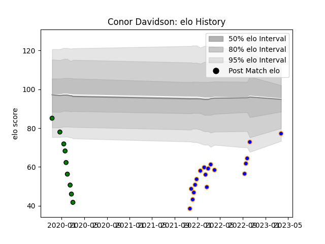

---  
layout: page  
title: Conor Davidson  
date: 2023-03-27 11:35:20.608752  
categories: player  
---
# Conor Davidson

Last updated: 2023-03-27
## Positions: P

## Current elo: 77.0

## Current Percentile: 7.0

# Elo History

# Match History

| Team               |   Appearances |   Win Rate |
|:-------------------|--------------:|-----------:|
| Doncaster          |            18 |   0.833333 |
| Yorkshire Carnegie |             9 |   0        |

| Opponent            |   Matches |   Win Rate |
|:--------------------|----------:|-----------:|
| Ealing Trailfinders |         4 |   0.5      |
| Cornish Pirates     |         3 |   0.333333 |
| Coventry            |         3 |   0.333333 |
| Hartpury College    |         3 |   1        |
| Nottingham          |         3 |   0.666667 |
| Bedford             |         2 |   1        |
| Jersey              |         2 |   0.5      |
| London Scottish     |         2 |   0.5      |
| Richmond            |         2 |   1        |
| Ampthill            |         1 |   0        |
| Doncaster           |         1 |   0        |
| Newcastle Falcons   |         1 |   0        |