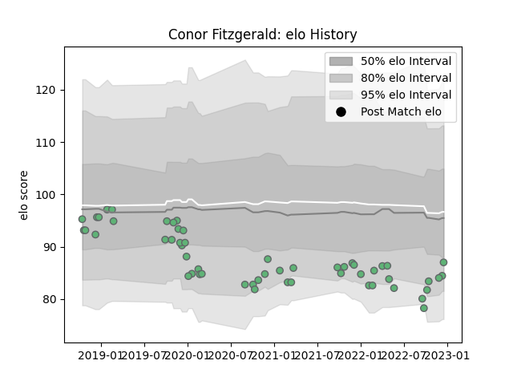

---  
layout: page  
title: Conor Fitzgerald  
date: 2023-01-13 11:25:11.982896  
categories: player  
---
# Conor Fitzgerald

## Positions: FH, FB

## Current elo: 77.0

## Current Percentile: 13.0

# Elo History

# Match History

| Team     |   Appearances |   Win Rate |
|:---------|--------------:|-----------:|
| Connacht |            58 |   0.517241 |

| Opponent             |   Matches |   Win Rate |
|:---------------------|----------:|-----------:|
| Munster              |         5 |   0.4      |
| Leinster             |         4 |   0        |
| Ulster               |         4 |   0.25     |
| Ospreys              |         4 |   0.5      |
| Benetton Treviso     |         4 |   1        |
| Cardiff Blues        |         4 |   0.25     |
| Edinburgh            |         3 |   0.333333 |
| Scarlets             |         3 |   0.333333 |
| Stormers             |         2 |   0.5      |
| Southern Kings       |         2 |   1        |
| Sharks               |         2 |   0.5      |
| Perpignan            |         2 |   1        |
| Zebre                |         2 |   1        |
| Montpellier Herault  |         2 |   0.5      |
| Cheetahs             |         2 |   1        |
| Gloucester Rugby     |         2 |   0.5      |
| Glasgow Warriors     |         2 |   0.5      |
| Bordeaux Begles      |         1 |   1        |
| Newcastle Falcons    |         1 |   1        |
| Lions                |         1 |   1        |
| Sale Sharks          |         1 |   0        |
| Leicester Tigers     |         1 |   0        |
| Stade Francais Paris |         1 |   1        |
| Stade Toulousain     |         1 |   0        |
| Brive                |         1 |   1        |
| Dragons              |         1 |   0        |