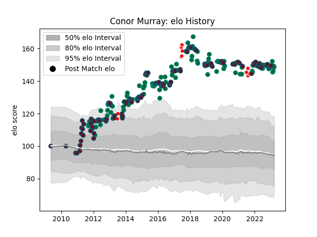

---  
layout: page  
title: Conor Murray  
date: 2023-03-17 17:36:17.308427  
categories: player  
---
# Conor Murray

## Positions: SH

## Country: Ireland

## Current elo: 148.0

## Current Percentile: 99.0

# Elo History

# Match History

| Team                    |   Appearances |   Win Rate |
|:------------------------|--------------:|-----------:|
| Munster                 |           172 |   0.630814 |
| Ireland                 |           102 |   0.651961 |
| British and Irish Lions |            11 |   0.590909 |

| Opponent                 |   Matches |   Win Rate |
|:-------------------------|----------:|-----------:|
| Leinster                 |        26 |   0.230769 |
| Wales                    |        15 |   0.5      |
| New Zealand              |        14 |   0.392857 |
| France                   |        13 |   0.692308 |
| Edinburgh                |        13 |   0.923077 |
| Scotland                 |        12 |   0.833333 |
| Italy                    |        12 |   0.916667 |
| England                  |        11 |   0.363636 |
| Ulster                   |        11 |   0.5      |
| Connacht                 |        11 |   0.727273 |
| Ospreys                  |        11 |   0.545455 |
| South Africa             |        10 |   0.5      |
| Australia                |         9 |   0.666667 |
| Racing 92                |         9 |   0.5      |
| Castres Olympique        |         8 |   0.8125   |
| Zebre                    |         7 |   1        |
| Glasgow Warriors         |         7 |   0.571429 |
| Scarlets                 |         7 |   0.785714 |
| Saracens                 |         6 |   0.5      |
| Leicester Tigers         |         6 |   0.5      |
| Cardiff Blues            |         6 |   0.666667 |
| Argentina                |         5 |   0.8      |
| Benetton Treviso         |         5 |   1        |
| Dragons                  |         5 |   0.8      |
| Stade Toulousain         |         4 |   0.375    |
| Clermont Auvergne        |         4 |   0.25     |
| Gloucester Rugby         |         3 |   1        |
| Japan                    |         3 |   0.666667 |
| Exeter Chiefs            |         3 |   0.666667 |
| Northampton Saints       |         3 |   1        |
| Harlequins               |         3 |   0.666667 |
| Samoa                    |         2 |   1        |
| Wasps                    |         2 |   1        |
| Toulon                   |         2 |   0.5      |
| Stade Francais Paris     |         2 |   0.5      |
| Aironi                   |         2 |   1        |
| Sale Sharks              |         1 |   1        |
| Cheetahs                 |         1 |   1        |
| Romania                  |         1 |   1        |
| Canada                   |         1 |   1        |
| Bulls                    |         1 |   1        |
| Perpignan                |         1 |   1        |
| Crusaders                |         1 |   1        |
| New Zealand Maori        |         1 |   1        |
| Brive                    |         1 |   1        |
| United States of America |         1 |   1        |
| Lions                    |         1 |   1        |
| Fiji                     |         1 |   1        |
| Russia                   |         1 |   1        |