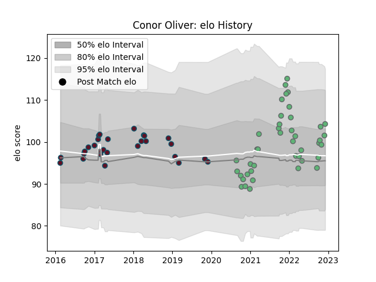

---  
layout: page  
title: Conor Oliver  
date: 2023-02-02 18:57:30.955909  
categories: player  
---
# Conor Oliver

## Positions: FL

## Current elo: 113.0

## Current Percentile: 78.0

# Elo History

# Match History

| Team     |   Appearances |   Win Rate |
|:---------|--------------:|-----------:|
| Connacht |            48 |   0.4375   |
| Munster  |            28 |   0.732143 |

| Opponent             |   Matches |   Win Rate |
|:---------------------|----------:|-----------:|
| Ulster               |         8 |   0.3125   |
| Munster              |         7 |   0.285714 |
| Edinburgh            |         7 |   0.428571 |
| Ospreys              |         6 |   0.666667 |
| Leinster             |         5 |   0.2      |
| Scarlets             |         5 |   0.2      |
| Dragons              |         5 |   0.8      |
| Benetton Treviso     |         4 |   1        |
| Zebre                |         4 |   1        |
| Cardiff Blues        |         4 |   0.5      |
| Glasgow Warriors     |         3 |   0.666667 |
| Connacht             |         3 |   1        |
| Leicester Tigers     |         2 |   0        |
| Sharks               |         2 |   0.5      |
| Stade Francais Paris |         2 |   0.5      |
| Bulls                |         2 |   0.5      |
| Lions                |         2 |   1        |
| Brive                |         1 |   1        |
| Newcastle Falcons    |         1 |   0        |
| Cheetahs             |         1 |   1        |
| Southern Kings       |         1 |   1        |
| Stormers             |         1 |   1        |