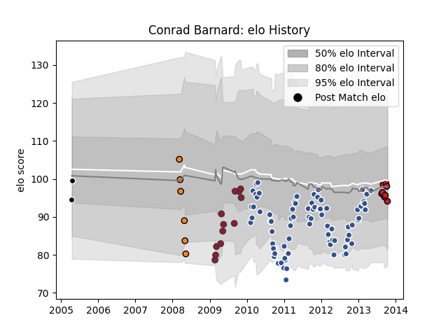

---  
layout: page  
title: Conrad Barnard  
date: 2023-03-12 11:29:25.523262  
categories: player  
---
# Conrad Barnard

## Positions: FH

## Current elo: 94.0

## Current Percentile: 40.0

# Elo History

# Match History

| Team     |   Appearances |   Win Rate |
|:---------|--------------:|-----------:|
| Agen     |            83 |    0.46988 |
| Toulon   |            12 |    0.625   |
| Oyonnax  |             8 |    0.3125  |
| Cheetahs |             6 |    0       |
| Sharks   |             2 |    0       |

| Opponent             |   Matches |   Win Rate |
|:---------------------|----------:|-----------:|
| Bayonne              |         8 |   0.4375   |
| Montpellier Herault  |         8 |   0.25     |
| Biarritz Olympique   |         7 |   0.214286 |
| Toulon               |         7 |   0.428571 |
| Racing 92            |         7 |   0.285714 |
| Clermont Auvergne    |         6 |   0.333333 |
| Bordeaux Begles      |         6 |   0.5      |
| Castres Olympique    |         6 |   0.5      |
| Stade Francais Paris |         6 |   0.166667 |
| Perpignan            |         5 |   0.5      |
| Stade Toulousain     |         5 |   0.4      |
| Brive                |         4 |   1        |
| La Rochelle          |         4 |   0.5      |
| Grenoble             |         3 |   0.5      |
| Bourgoin-Jallieu     |         3 |   0.666667 |
| Lyon                 |         2 |   1        |
| Dax                  |         2 |   1        |
| Gloucester Rugby     |         2 |   0.5      |
| Mont-de-Marsan       |         2 |   1        |
| Sharks               |         1 |   0        |
| Provence Rugby       |         1 |   1        |
| Queensland Reds      |         1 |   0        |
| Oyonnax              |         1 |   1        |
| Tarbes               |         1 |   0        |
| Pau                  |         1 |   0.5      |
| Albi                 |         1 |   1        |
| Narbonne             |         1 |   1        |
| Montauban            |         1 |   0        |
| Lannemezan           |         1 |   1        |
| Hurricanes           |         1 |   0        |
| Highlanders          |         1 |   0        |
| Crusaders            |         1 |   0        |
| Colomiers            |         1 |   1        |
| Chiefs               |         1 |   0        |
| Brumbies             |         1 |   0        |
| Blues                |         1 |   0        |
| Worcester Warriors   |         1 |   0.5      |