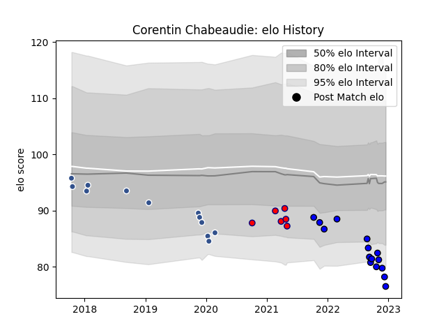

---  
layout: page  
title: Corentin Chabeaudie  
date: 2023-01-15 11:53:28.096592  
categories: player  
---
# Corentin Chabeaudie

## Positions: P, H

## Current elo: 94.0

## Current Percentile: 44.0

# Elo History

# Match History

| Team                       |   Appearances |   Win Rate |
|:---------------------------|--------------:|-----------:|
| Massy                      |            28 |   0.607143 |
| Agen                       |            12 |   0.166667 |
| Cognac Saint Jean d'Angély |             6 |   0.5      |

| Opponent                   |   Matches |   Win Rate |
|:---------------------------|----------:|-----------:|
| Dijon                      |         3 |        1   |
| Albi                       |         2 |        0.5 |
| Wasps                      |         2 |        0   |
| Valence Romans Drome Rugby |         2 |        1   |
| Tarbes                     |         2 |        1   |
| Suresnes                   |         2 |        1   |
| Nice                       |         2 |        0.5 |
| Gloucester Rugby           |         2 |        0   |
| Edinburgh                  |         2 |        0   |
| Mont-de-Marsan             |         2 |        0.5 |
| Zebre                      |         2 |        0.5 |
| Bourgoin-Jallieu           |         2 |        1   |
| Chambery                   |         2 |        1   |
| Cognac Saint Jean d'Angély |         2 |        1   |
| Rouen                      |         1 |        0   |
| Aurillac                   |         1 |        0   |
| Vannes                     |         1 |        0   |
| Bordeaux Begles            |         1 |        0   |
| US Bressane                |         1 |        0   |
| Brive                      |         1 |        1   |
| Soyaux-Angouleme           |         1 |        0   |
| Colomiers                  |         1 |        0   |
| Racing 92                  |         1 |        0   |
| Oyonnax                    |         1 |        0   |
| Nevers                     |         1 |        0   |
| Montauban                  |         1 |        0   |
| Aubenas                    |         1 |        1   |
| Massy                      |         1 |        0   |
| Harlequins                 |         1 |        0   |
| Grenoble                   |         1 |        0   |
| Provence Rugby             |         1 |        1   |