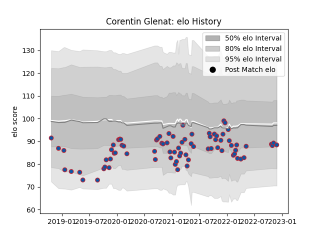

---  
layout: page  
title: Corentin Glenat  
date: 2022-12-14 11:19:58.325632  
categories: player  
---
# Corentin Glenat

## Positions: FH, FB

## Current elo: 95.0

## Current Percentile: 41.0

# Elo History

# Match History

| Team     |   Appearances |   Win Rate |
|:---------|--------------:|-----------:|
| Grenoble |            51 |   0.470588 |

| Opponent            |   Matches |   Win Rate |
|:--------------------|----------:|-----------:|
| Vannes              |         4 |   0.5      |
| Nevers              |         4 |   0.75     |
| Colomiers           |         4 |   0.25     |
| Oyonnax             |         4 |   0.5      |
| Mont-de-Marsan      |         4 |   0.5      |
| Montauban           |         4 |   0.75     |
| Aurillac            |         4 |   0.5      |
| Carcassonne         |         3 |   0.666667 |
| Soyaux-Angouleme    |         2 |   0.5      |
| Rouen               |         2 |   0.5      |
| Provence Rugby      |         2 |   0.5      |
| Perpignan           |         2 |   0        |
| Agen                |         2 |   0.5      |
| Harlequins          |         2 |   0.5      |
| Narbonne            |         1 |   1        |
| Pau                 |         1 |   0        |
| Clermont Auvergne   |         1 |   0        |
| Biarritz Olympique  |         1 |   0        |
| Beziers             |         1 |   0        |
| Roval Drome XV      |         1 |   1        |
| Benetton Treviso    |         1 |   0        |
| Montpellier Herault |         1 |   0        |