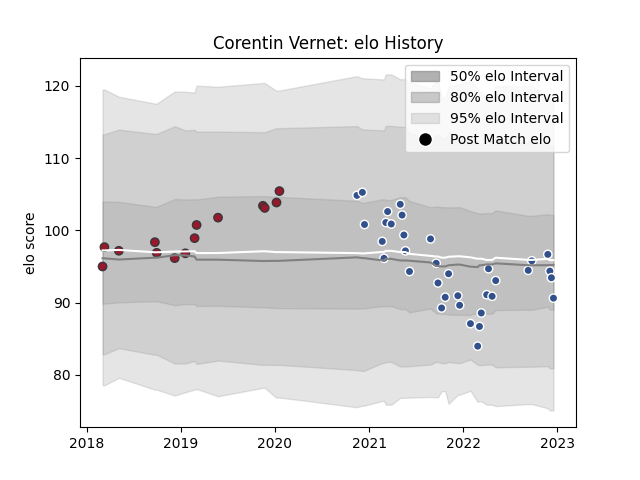

---  
layout: page  
title: Corentin Vernet  
date: 2023-02-04 18:26:18.030161  
categories: player  
---
# Corentin Vernet

## Positions: L

## Current elo: 84.0

## Current Percentile: 22.0

# Elo History

# Match History

| Team   |   Appearances |   Win Rate |
|:-------|--------------:|-----------:|
| Agen   |            41 |   0.207317 |
| Toulon |            20 |   0.7      |

| Opponent             |   Matches |   Win Rate |
|:---------------------|----------:|-----------:|
| Bayonne              |         5 |   0.5      |
| Agen                 |         3 |   1        |
| Nevers               |         3 |   0.333333 |
| Rouen                |         3 |   0.666667 |
| Pau                  |         3 |   0.333333 |
| Montauban            |         3 |   0.333333 |
| Brive                |         3 |   0        |
| Aurillac             |         2 |   0.5      |
| Toulon               |         2 |   0        |
| Stade Francais Paris |         2 |   0        |
| Beziers              |         2 |   0        |
| Provence Rugby       |         2 |   0.5      |
| Bordeaux Begles      |         2 |   0        |
| Castres Olympique    |         2 |   1        |
| Montpellier Herault  |         2 |   0.5      |
| Carcassonne          |         2 |   0.5      |
| Mont-de-Marsan       |         2 |   0        |
| Lyon                 |         2 |   0        |
| La Rochelle          |         2 |   0.5      |
| Clermont Auvergne    |         2 |   0        |
| Massy                |         1 |   1        |
| Narbonne             |         1 |   0        |
| Newcastle Falcons    |         1 |   1        |
| Oyonnax              |         1 |   0        |
| London Irish         |         1 |   0        |
| Perpignan            |         1 |   1        |
| Racing 92            |         1 |   1        |
| Grenoble             |         1 |   0        |
| Scarlets             |         1 |   1        |
| Colomiers            |         1 |   0        |
| US Bressane          |         1 |   0        |
| Vannes               |         1 |   0        |