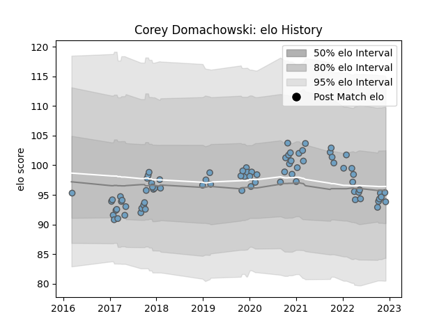

---  
layout: page  
title: Corey Domachowski  
date: 2023-02-02 19:00:10.127865  
categories: player  
---
# Corey Domachowski

## Positions: P

## Current elo: 87.0

## Current Percentile: 26.0

# Elo History

# Match History

| Team          |   Appearances |   Win Rate |
|:--------------|--------------:|-----------:|
| Cardiff Blues |            87 |   0.465517 |

| Opponent           |   Matches |   Win Rate |
|:-------------------|----------:|-----------:|
| Scarlets           |         9 |   0.444444 |
| Edinburgh          |         8 |   0.25     |
| Connacht           |         6 |   0.666667 |
| Dragons            |         6 |   1        |
| Leinster           |         5 |   0.2      |
| Munster            |         5 |   0        |
| Benetton Treviso   |         4 |   0.75     |
| Ospreys            |         4 |   0.25     |
| Zebre              |         4 |   1        |
| Glasgow Warriors   |         4 |   0.25     |
| Pau                |         3 |   0.666667 |
| Leicester Tigers   |         3 |   0        |
| Ulster             |         3 |   0.166667 |
| Sale Sharks        |         3 |   0.333333 |
| Lions              |         2 |   0        |
| Lyon               |         2 |   1        |
| Stormers           |         2 |   0.5      |
| Southern Kings     |         2 |   1        |
| Bulls              |         2 |   0        |
| Sharks             |         1 |   1        |
| Worcester Warriors |         1 |   0        |
| Stade Toulousain   |         1 |   1        |
| Gloucester Rugby   |         1 |   0        |
| Harlequins         |         1 |   0        |
| Calvisano          |         1 |   1        |
| Newcastle Falcons  |         1 |   1        |
| Cheetahs           |         1 |   1        |
| Bristol Rugby      |         1 |   1        |
| London Irish       |         1 |   0        |