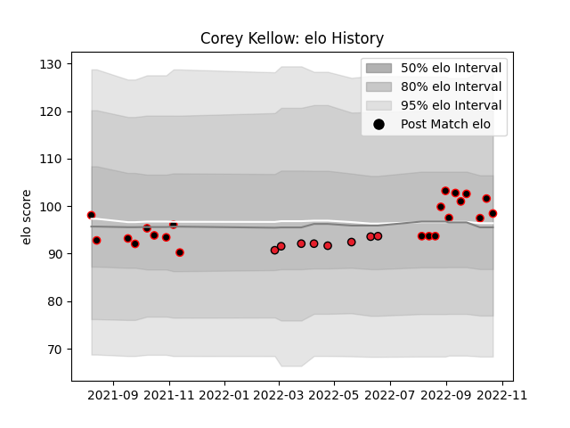

---  
layout: page  
title: Corey Kellow  
date: 2023-03-11 00:16:12.627081  
categories: player  
---
# Corey Kellow

## Positions: FL

## Current elo: 98.0

## Current Percentile: 64.0

# Elo History

# Match History

| Team       |   Appearances |   Win Rate |
|:-----------|--------------:|-----------:|
| Canterbury |            21 |   0.714286 |
| Crusaders  |             8 |   1        |

| Opponent         |   Matches |   Win Rate |
|:-----------------|----------:|-----------:|
| Wellington       |         3 |   0.333333 |
| Hawke's Bay      |         2 |   0.5      |
| Waikato          |         2 |   0.5      |
| Tasman           |         2 |   1        |
| Northland        |         2 |   1        |
| Bay of Plenty    |         2 |   1        |
| Auckland         |         2 |   0.5      |
| Chiefs           |         2 |   1        |
| Manawatu         |         2 |   1        |
| Highlanders      |         1 |   1        |
| Hurricanes       |         1 |   1        |
| Fijian Drua      |         1 |   1        |
| Melbourne Rebels |         1 |   1        |
| Moana Pasifika   |         1 |   1        |
| North Harbour    |         1 |   1        |
| Counties Manukau |         1 |   1        |
| Southland        |         1 |   1        |
| Taranaki         |         1 |   0        |
| Blues            |         1 |   1        |