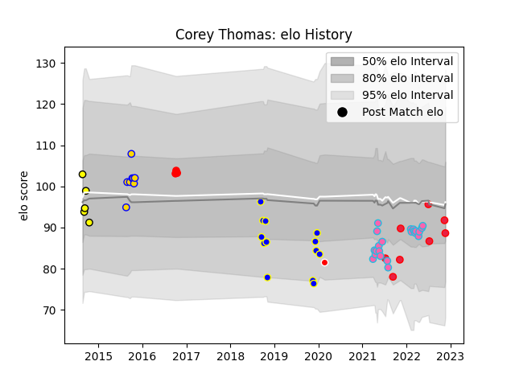

---  
layout: page  
title: Corey Thomas  
date: 2022-11-16 11:24:12.398101  
categories: player  
---
# Corey Thomas

## Positions: L, FL

## Country: Canada

## Current elo: 87.0

## Current Percentile: 14.0

# Elo History

# Match History

| Team              |   Appearances |   Win Rate |
|:------------------|--------------:|-----------:|
| Kamaishi Seawaves |            11 |   0.363636 |
| Canada            |             6 |   0.5      |
| L. A. Giltinis    |             5 |   1        |
| Brisbane City     |             3 |   1        |
| Perth Spirit      |             1 |   0        |
| Sunwolves         |             1 |   0        |

| Opponent                         |   Matches |   Win Rate |
|:---------------------------------|----------:|-----------:|
| Belgium                          |         2 |        1   |
| Hanazono Kintetsu Liners         |         2 |        0   |
| Toronto Arrows                   |         2 |        1   |
| Kurita Water Gush                |         2 |        0.5 |
| Mazda Blue Zoomers               |         2 |        0.5 |
| Perth Spirit                     |         1 |        1   |
| United States of America         |         1 |        0   |
| Toyota Industries Shuttles Aichi |         1 |        0   |
| Sydney Stars                     |         1 |        1   |
| Spain                            |         1 |        0   |
| Rugby ATL                        |         1 |        1   |
| Queensland Reds                  |         1 |        0   |
| NTT Docomo Red Hurricanes Osaka  |         1 |        0   |
| Netherlands                      |         1 |        1   |
| Canberra Vikings                 |         1 |        1   |
| Mitsubishi Dynaboars             |         1 |        0   |
| Melbourne Rising                 |         1 |        0   |
| Kyuden Voltex                    |         1 |        1   |
| Houston SaberCats                |         1 |        1   |
| England                          |         1 |        0   |
| Chugoku Red Regulions            |         1 |        1   |
| Utah Warriors                    |         1 |        1   |