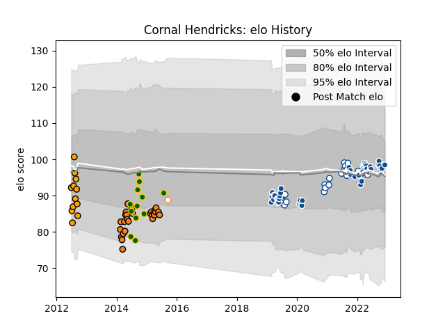

---  
layout: page  
title: Cornal Hendricks  
date: 2022-12-31 16:30:02.006319  
categories: player  
---
# Cornal Hendricks

## Positions: W, C

## Country: South Africa

## Current elo: 97.0

## Current Percentile: 61.0

# Elo History

# Match History

| Team                |   Appearances |   Win Rate |
|:--------------------|--------------:|-----------:|
| Bulls               |            48 |   0.520833 |
| Cheetahs            |            27 |   0.277778 |
| Blue Bulls          |            20 |   0.65     |
| Boland Cavaliers    |            12 |   0.208333 |
| South Africa        |            12 |   0.583333 |
| Free State Cheetahs |             1 |   0        |

| Opponent                 |   Matches |   Win Rate |
|:-------------------------|----------:|-----------:|
| Sharks                   |        12 |   0.5      |
| Lions                    |         8 |   0.5      |
| Stormers                 |         7 |   0.142857 |
| Pumas                    |         5 |   0.6      |
| Natal Sharks             |         4 |   0.25     |
| Blues                    |         4 |   0.375    |
| Griquas                  |         4 |   0.75     |
| Free State Cheetahs      |         4 |   0.5      |
| New Zealand              |         3 |   0.333333 |
| Eastern Province Kings   |         3 |   0        |
| Jaguares                 |         3 |   0        |
| Chiefs                   |         3 |   0.166667 |
| Wales                    |         3 |   0.666667 |
| Bulls                    |         3 |   0.333333 |
| Brumbies                 |         3 |   0.333333 |
| Western Province         |         3 |   0.666667 |
| Leopards                 |         2 |   0        |
| Queensland Reds          |         2 |   0        |
| New South Wales Waratahs |         2 |   0.5      |
| Western Force            |         2 |   0.5      |
| Munster                  |         2 |   0.5      |
| Melbourne Rebels         |         2 |   0.5      |
| SWD Eagles               |         2 |   0.25     |
| Argentina                |         2 |   1        |
| Leinster                 |         2 |   0.5      |
| Hurricanes               |         2 |   0        |
| Highlanders              |         2 |   0.75     |
| Griffons                 |         2 |   0        |
| Golden Lions             |         2 |   1        |
| Glasgow Warriors         |         2 |   0.5      |
| Edinburgh                |         2 |   0.5      |
| Australia                |         2 |   0.5      |
| Cardiff Blues            |         2 |   1        |
| Crusaders                |         2 |   0        |
| Connacht                 |         2 |   0.5      |
| Ulster                   |         1 |   1        |
| Benetton Treviso         |         1 |   1        |
| Border Bulldogs          |         1 |   1        |
| Valke                    |         1 |   1        |
| Dragons                  |         1 |   1        |
| Scotland                 |         1 |   1        |
| Scarlets                 |         1 |   1        |
| Ospreys                  |         1 |   1        |
| Ireland                  |         1 |   0        |
| Zebre                    |         1 |   1        |