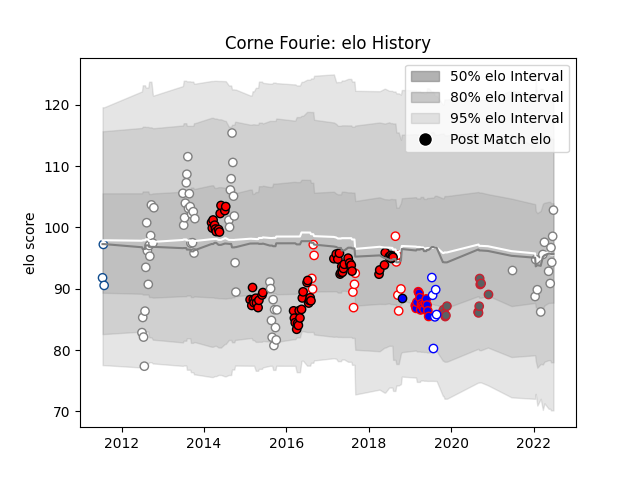

---  
layout: page  
title: Corne Fourie  
date: 2023-03-21 18:50:21.637684  
categories: player  
---
# Corne Fourie

Last updated: 2023-03-21
## Positions: P

## Current elo: 103.0

## Current Percentile: 60.0

# Elo History

# Match History

| Team                 |   Appearances |   Win Rate |
|:---------------------|--------------:|-----------:|
| Lions                |            64 |   0.679688 |
| Pumas                |            64 |   0.648438 |
| Stormers             |            16 |   0.46875  |
| Golden Lions         |            14 |   0.5      |
| Gloucester Rugby     |            13 |   0.307692 |
| Western Province     |             6 |   0.333333 |
| Blue Bulls           |             3 |   0.333333 |
| Saitama Wild Knights |             1 |   1        |

| Opponent                 |   Matches |   Win Rate |
|:-------------------------|----------:|-----------:|
| Sharks                   |        11 |   0.636364 |
| Free State Cheetahs      |         9 |   0.722222 |
| Griquas                  |         9 |   0.333333 |
| Eastern Province Kings   |         9 |   0.666667 |
| Natal Sharks             |         9 |   0.222222 |
| Crusaders                |         8 |   0.1875   |
| Bulls                    |         8 |   0.75     |
| Blue Bulls               |         7 |   0.285714 |
| Stormers                 |         7 |   0.642857 |
| Golden Lions             |         7 |   0.428571 |
| Western Province         |         7 |   0.142857 |
| Jaguares                 |         6 |   0.666667 |
| Hurricanes               |         5 |   0.2      |
| SWD Eagles               |         5 |   0.8      |
| Boland Cavaliers         |         5 |   1        |
| Pumas                    |         4 |   1        |
| Melbourne Rebels         |         4 |   1        |
| Valke                    |         4 |   1        |
| Leopards                 |         4 |   0.75     |
| Highlanders              |         4 |   0.5      |
| Griffons                 |         4 |   1        |
| Cheetahs                 |         4 |   1        |
| Border Bulldogs          |         4 |   1        |
| Blues                    |         4 |   0.75     |
| Leicester Tigers         |         3 |   0.333333 |
| New South Wales Waratahs |         3 |   0.666667 |
| Queensland Reds          |         3 |   0.666667 |
| Brumbies                 |         3 |   0.666667 |
| Southern Kings           |         3 |   1        |
| Lions                    |         2 |   0.5      |
| Sunwolves                |         2 |   1        |
| Western Force            |         2 |   0.5      |
| Saracens                 |         2 |   0        |
| Stade Toulousain         |         1 |   0        |
| Wasps                    |         1 |   1        |
| Bath Rugby               |         1 |   0        |
| Sale Sharks              |         1 |   1        |
| Montpellier Herault      |         1 |   0        |
| London Irish             |         1 |   1        |
| Harlequins               |         1 |   0        |
| Exeter Chiefs            |         1 |   0        |
| Chiefs                   |         1 |   1        |
| Yokohama Canon Eagles    |         1 |   1        |