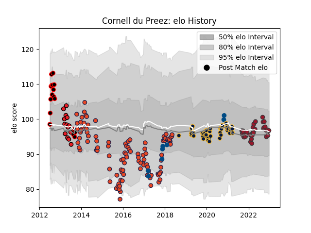

---  
layout: page  
title: Cornell du Preez  
date: 2022-11-15 23:39:09.104032  
categories: player  
---
# Cornell du Preez

## Positions: N8, FL

## Country: Scotland

## Current elo: 96.0

## Current Percentile: 58.0

# Elo History

# Match History

| Team                   |   Appearances |   Win Rate |
|:-----------------------|--------------:|-----------:|
| Edinburgh              |           105 |   0.490476 |
| Worcester Warriors     |            38 |   0.263158 |
| Toulon                 |            30 |   0.5      |
| Eastern Province Kings |            17 |   0.882353 |
| Southern Kings         |            14 |   0.25     |
| Scotland               |             9 |   0.555556 |

| Opponent                 |   Matches |   Win Rate |
|:-------------------------|----------:|-----------:|
| Munster                  |        10 |   0.3      |
| Dragons                  |        10 |   0.8      |
| Glasgow Warriors         |         9 |   0.555556 |
| Zebre                    |         8 |   0.625    |
| Ulster                   |         8 |   0.375    |
| Benetton Treviso         |         7 |   0.571429 |
| Cardiff Blues            |         7 |   0.142857 |
| Leinster                 |         7 |   0.285714 |
| Connacht                 |         7 |   0.285714 |
| Ospreys                  |         7 |   0.428571 |
| Gloucester Rugby         |         6 |   0.333333 |
| Scarlets                 |         6 |   0.416667 |
| London Irish             |         6 |   0.666667 |
| Perpignan                |         5 |   0.4      |
| Northampton Saints       |         5 |   0        |
| Wasps                    |         5 |   0        |
| Stade Francais Paris     |         5 |   0.4      |
| Harlequins               |         4 |   0.75     |
| Castres Olympique        |         4 |   0        |
| Pumas                    |         3 |   0.333333 |
| SWD Eagles               |         3 |   1        |
| Stade Toulousain         |         3 |   0.333333 |
| Sale Sharks              |         3 |   0.666667 |
| Montpellier Herault      |         3 |   0.166667 |
| Leicester Tigers         |         3 |   0.333333 |
| La Rochelle              |         3 |   0.333333 |
| Bath Rugby               |         3 |   0        |
| Clermont Auvergne        |         3 |   0.666667 |
| Bristol Rugby            |         3 |   0        |
| Boland Cavaliers         |         3 |   1        |
| Grenoble                 |         2 |   0.5      |
| Saracens                 |         2 |   1        |
| Griffons                 |         2 |   1        |
| Brive                    |         2 |   0.5      |
| Border Bulldogs          |         2 |   1        |
| Southern Kings           |         2 |   1        |
| Bordeaux Begles          |         2 |   0.5      |
| Cheetahs                 |         2 |   0        |
| Biarritz Olympique       |         2 |   1        |
| Stormers                 |         2 |   0        |
| Valke                    |         2 |   1        |
| Wales                    |         2 |   0.5      |
| Bulls                    |         2 |   0        |
| Pau                      |         2 |   0.75     |
| Lyon                     |         2 |   1        |
| Leopards                 |         2 |   1        |
| Krasny Yar               |         2 |   1        |
| New Zealand              |         1 |   0        |
| Australia                |         1 |   1        |
| Western Force            |         1 |   1        |
| Georgia                  |         1 |   1        |
| Highlanders              |         1 |   1        |
| Ireland                  |         1 |   0        |
| Bayonne                  |         1 |   1        |
| Timisoara Saracens       |         1 |   1        |
| Italy                    |         1 |   1        |
| Sharks                   |         1 |   0        |
| Exeter Chiefs            |         1 |   0        |
| New South Wales Waratahs |         1 |   0        |
| England                  |         1 |   0        |
| Samoa                    |         1 |   1        |
| Crusaders                |         1 |   0        |
| Racing 92                |         1 |   0        |
| Melbourne Rebels         |         1 |   1        |
| Brumbies                 |         1 |   0.5      |
| Chiefs                   |         1 |   0        |
| Agen                     |         1 |   1        |